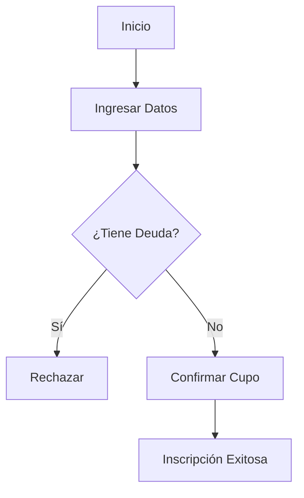

# Objetivo
Transformar el código fuente de GradoXpert en documentación útil y legible para dos perfiles: el **Usuario Funcional** (qué hace el sistema y cómo se usa) y el **Desarrollador** (cómo está construido y qué clases intervienen), manteniendo la coherencia con la Arquitectura Limpia y DDD.

# Instrucciones

## 1. Análisis del Caso de Uso (Insumos)
Antes de escribir, debes identificar:
- **Punto de Entrada**: El `Command` o `Query` de MediatR.
- **Flujo de Negocio**: Lógica dentro del `Handler` y las entidades del **Dominio**.
- **Interfaz**: Componentes Blazor/Radzen que disparan la acción.
- **Persistencia**: Tablas de SQL Server afectadas.

## 2. Estructura del Documento (.md)
Genera siempre un único archivo Markdown con estas dos secciones claramente diferenciadas:

### A. Perspectiva Funcional (Manual de Usuario)
- **Propósito**: Explicar el "Para qué" en lenguaje no técnico.
- **Actores**: Quién tiene permiso para ejecutar esto.
- **Guía de Uso**: Paso a paso narrativo ("El usuario hace clic en...", "El sistema muestra...").
- **Reglas de Negocio**: Qué validaciones ocurren (Ej: "No se permite si el saldo es menor a 0").
- **Diagrama de Flujo**: Crear un diagrama `mermaid` de tipo `graph TD` para el proceso funcional.

### B. Perspectiva Técnica (Guía del Desarrollador)
- **Mapa de Componentes**: Tabla con: Capa, Proyecto, Archivo y Responsabilidad.
- **Contrato de Datos**: Descripción del DTO/Command de entrada.
- **Lógica de Dominio**: Indicar exactamente en qué Entidad o Value Object reside la lógica.
- **Diagrama de Secuencia**: Crear un diagrama `mermaid` de tipo `sequenceDiagram` que muestre el flujo: UI -> WebApi -> Application (Handler) -> Domain -> Infrastructure (DB).

# Ejemplos

## Input: "Documenta el caso de uso de Inscripción de Alumnos"
**Output Esperado:**
```markdown
# Caso de Uso: Inscripción de Alumnos

## 👥 Perspectiva Funcional
### Objetivo
Permitir que un administrativo registre a un nuevo alumno en el sistema validando sus requisitos previos.

### Guía de Uso
1. Ingrese al módulo "Academia > Inscripciones".
2. Complete los datos básicos (Nombre, Documento, Carrera).
3. Presione "Confirmar Inscripción".

### Reglas de Oro
- El alumno no debe tener deudas pendientes.
- El cupo de la carrera debe estar disponible.



## 💻 Perspectiva Técnica
### Mapa de Archivos
| Capa | Proyecto | Archivo |
| :--- | :--- | :--- |
| Presentación | `Web.Blazor` | `InscripcionForm.razor` |
| Aplicación | `Application` | `InscribirAlumnoCommand.cs` |
| Dominio | `Domain` | `Alumno.cs` (Método `Inscribir`) |

### Flujo de Datos
El comando `InscribirAlumnoCommand` requiere `AlumnoId` y `CarreraId`. Se procesa mediante `InscribirAlumnoHandler`.
```

# Restricciones
- ✅ **Idioma**: 100% Español para descripciones de negocio.
- ✅ **Nomenclatura**: Mantener nombres de clases y métodos en Inglés (según estándar del proyecto).
- ✅ **Formato**: Markdown estándar con soporte para Mermaid.
- ✅ **Ubicación**: Sugerir siempre guardar en una carpeta `docs/use-cases/`.

<!-- Generated by Skill Creator Ultra v1.0 -->
