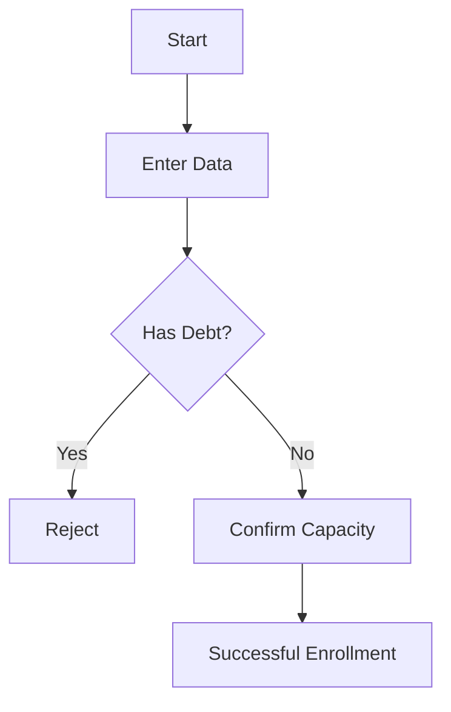

# Goal
Transform GrupoXpert's source code into useful and readable documentation for two profiles: the **Functional User** (what the system does and how it is used) and the **Developer** (how it is built and which classes are involved), maintaining consistency with Clean Architecture and DDD.

# Instructions

## 1. Use Case Analysis (Inputs)
Before writing, you must identify:
- **Entry Point**: The MediatR `Command` or `Query`.
- **Business Flow**: Logic within the `Handler` and **Domain** entities.
- **Interface**: Blazor/Radzen components that trigger the action.
- **Persistence**: Affected SQL Server tables.

## 2. Document Structure (.md)
Always generate a single Markdown file with these two clearly differentiated sections:

### A. Functional Perspective (User Manual)
- **Purpose**: Explain the "Why" in non-technical language.
- **Actors**: Who has permission to execute this.
- **Usage Guide**: Narrative step-by-step ("The user clicks on...", "The system shows...").
- **Business Rules**: What validations occur (e.g., "Not allowed if balance is less than 0").
- **Flowchart**: Create a `mermaid` `graph TD` diagram for the functional process.

### B. Technical Perspective (Developer Guide)
- **Component Map**: Table with: Layer, Project, File, and Responsibility.
- **Data Contract**: Description of the input DTO/Command.
- **Domain Logic**: Indicate exactly in which Entity or Value Object the logic resides.
- **Sequence Diagram**: Create a `mermaid` `sequenceDiagram` showing the flow: UI -> WebApi -> Application (Handler) -> Domain -> Infrastructure (DB).

## 3. Post-Processing (Use Case Closing)
Once the documentation is generated and accepted:
1.  **Update the Plan**: Find the corresponding use case in `e:\Documentos\Proyectos\GradoXpert\docs\plan use-cases\plan.md` and mark it as completed by changing `[ ]` to `[x]` in the Status column.
2.  **Confirmation**: Inform the user that the plan has been updated.

# Examples

## Input: "Document the Student Enrollment use case"
**Expected Output:**
```markdown
# Use Case: Student Enrollment

## 👥 Functional Perspective
### Goal
Allow an administrator to register a new student in the system, validating their prerequisites.

### Usage Guide
1. Go to the "Academy > Enrollments" module.
2. Complete the basic data (Name, ID, Major).
3. Press "Confirm Enrollment".

### Golden Rules
- The student must not have outstanding debts.
- The major's capacity must be available.



## 💻 Technical Perspective
### File Map
| Layer | Project | File |
| :--- | :--- | :--- |
| Presentation | `Web.Blazor` | `InscripcionForm.razor` |
| Application | `Application` | `InscribirAlumnoCommand.cs` |
| Domain | `Domain` | `Alumno.cs` (`Inscribir` method) |

### Data Flow
The `InscribirAlumnoCommand` command requires `AlumnoId` and `CarreraId`. It is processed via `InscribirAlumnoHandler`.
```

# Constraints
- ✅ **Language**: 100% English for business and technical descriptions (as requested).
- ✅ **Nomenclature**: Maintain class and method names in the project's standard (English/Spanish mix as defined).
- ✅ **Format**: Standard Markdown with Mermaid support.
- ✅ **Output Location**: ALWAYS save in `e:\Documentos\Proyectos\GradoXpert\docs\use-cases\`.
- ✅ **Filename**: Use strict **snake_case** derived from the use case name in the plan.
    - Example: `Recuperar / Restablecer Contraseña` -> `recuperar_restables_contraseña.md`.
- ✅ **Mandatory Update**: It is MANDATORY to mark the use case with `[x]` in `plan.md` upon completion.

<!-- Generated by Skill Creator Ultra v1.0 -->
