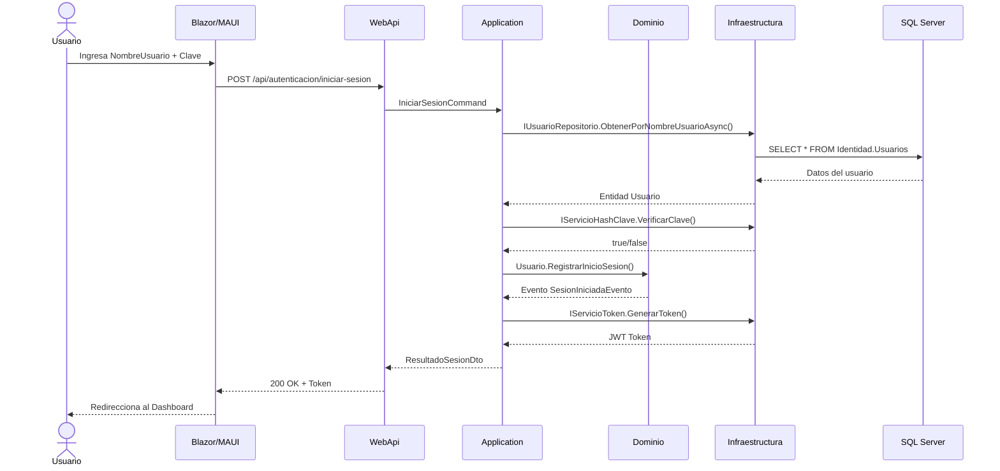
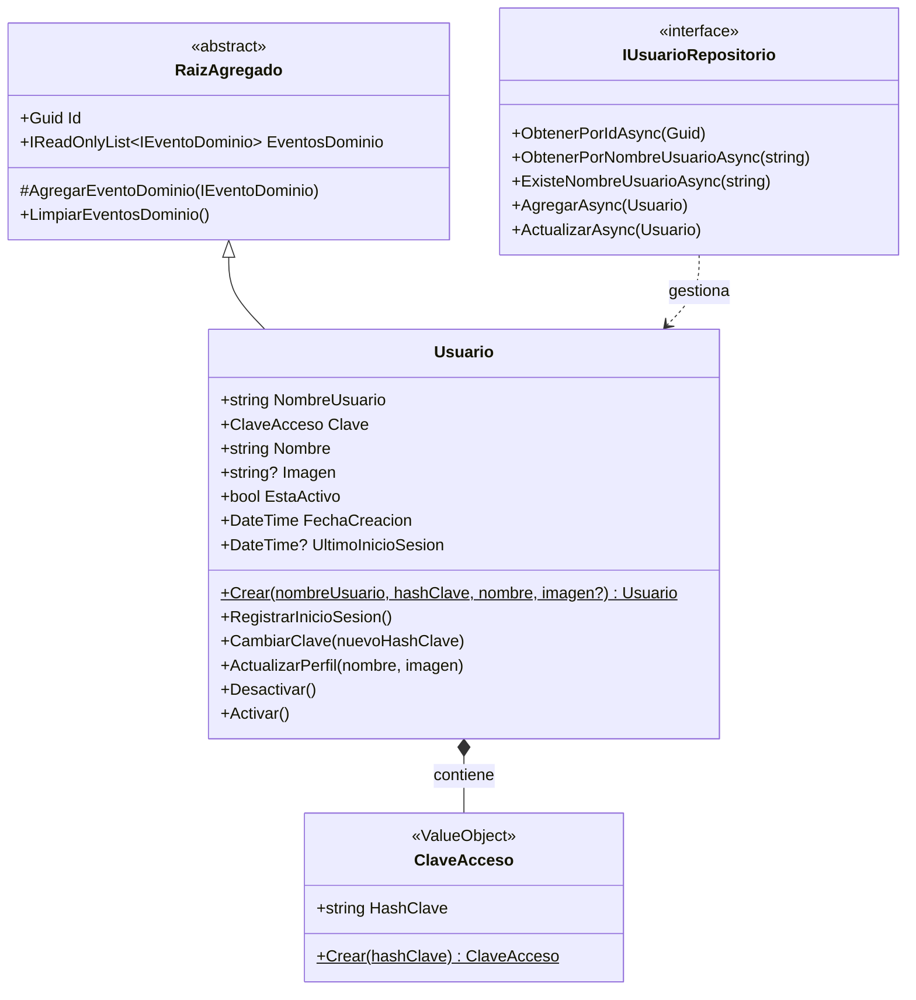

# 🏛️ Diseño Arquitectónico — Caso de Uso: Login / Autenticación

> **Contexto Delimitado:** `IDENTIDAD`  
> **Agregado Raíz:** `Usuario`  
> **Fecha:** 2026-04-22  
> **Estado:** ✅ Dominio implementado y compilado

---

## 1. Análisis del Caso de Uso

### Descripción
El usuario ingresa su **nombre de usuario** y **clave** para autenticarse en la aplicación GrupoXpert. El sistema valida las credenciales y, de ser correctas, registra el inicio de sesión y genera un token de acceso.

### Flujo Principal


---

## 2. Modelo de Dominio

### Contexto Delimitado: **IDENTIDAD**

| Elemento | Tipo | Archivo |
|---|---|---|
| `Usuario` | Raíz de Agregado | `Identidad/Usuario.cs` |
| `ClaveAcceso` | Objeto de Valor | `Identidad/ClaveAcceso.cs` |
| `IUsuarioRepositorio` | Interfaz Repositorio | `Identidad/IUsuarioRepositorio.cs` |
| `UsuarioCreadoEvento` | Evento de Dominio | `Identidad/Eventos/UsuarioCreadoEvento.cs` |
| `SesionIniciadaEvento` | Evento de Dominio | `Identidad/Eventos/SesionIniciadaEvento.cs` |

### Diagrama de Clases


### Invariantes del Dominio
| Regla | Descripción |
|---|---|
| **R1** | El nombre de usuario es obligatorio (3-50 caracteres) |
| **R2** | El nombre de usuario se normaliza a minúsculas |
| **R3** | El nombre completo es obligatorio (máx. 150 caracteres) |
| **R4** | La clave nunca se almacena en texto plano (solo hash) |
| **R5** | No se permite iniciar sesión con cuenta inactiva |
| **R6** | No se permite cambiar la clave de una cuenta inactiva |

---

## 3. Clases Base Creadas (Common/)

| Archivo | Descripción |
|---|---|
| `Entidad.cs` | Identidad por `Guid`, igualdad referencial |
| `ObjetoValor.cs` | Igualdad estructural por componentes |
| `RaizAgregado.cs` | Extiende Entidad + soporte de eventos de dominio |
| `IEventoDominio.cs` | Interfaz marcadora para eventos |
| `ExcepcionDominio.cs` | Excepción base del dominio |

---

## 4. Insumo para el DBA (Skill `dba`)

### Esquema Físico: `Identidad.Usuarios`

```sql
-- Esquema: Identidad
-- Tabla: Usuarios (Aggregate Root)

CREATE TABLE [Identidad].[Usuarios] (
    [Id]                 UNIQUEIDENTIFIER    NOT NULL    DEFAULT NEWSEQUENTIALID(),
    [NombreUsuario]      NVARCHAR(50)        NOT NULL,
    [HashClave]          NVARCHAR(500)       NOT NULL,
    [Nombre]             NVARCHAR(150)       NOT NULL,
    [Imagen]             NVARCHAR(500)       NULL,
    [EstaActivo]         BIT                 NOT NULL    DEFAULT 1,
    [FechaCreacion]      DATETIME2(7)        NOT NULL    DEFAULT SYSUTCDATETIME(),
    [UltimoInicioSesion] DATETIME2(7)        NULL,

    CONSTRAINT [PK_Usuarios] PRIMARY KEY CLUSTERED ([Id]),
    CONSTRAINT [UQ_Usuarios_NombreUsuario] UNIQUE ([NombreUsuario])
);

-- Índice para búsqueda por nombre de usuario (login)
CREATE NONCLUSTERED INDEX [IX_Usuarios_NombreUsuario]
    ON [Identidad].[Usuarios] ([NombreUsuario])
    INCLUDE ([HashClave], [EstaActivo]);

-- Índice para filtrar usuarios activos
CREATE NONCLUSTERED INDEX [IX_Usuarios_EstaActivo]
    ON [Identidad].[Usuarios] ([EstaActivo])
    WHERE [EstaActivo] = 1;
```

### Mapeo Dominio → Base de Datos
| Propiedad Dominio | Columna SQL | Tipo SQL | Notas |
|---|---|---|---|
| `Id` | `Id` | `UNIQUEIDENTIFIER` | PK, NEWSEQUENTIALID |
| `NombreUsuario` | `NombreUsuario` | `NVARCHAR(50)` | Unique, normalizado lowercase |
| `Clave.HashClave` | `HashClave` | `NVARCHAR(500)` | Value Object aplanado |
| `Nombre` | `Nombre` | `NVARCHAR(150)` | - |
| `Imagen` | `Imagen` | `NVARCHAR(500)` | Nullable, ruta/URL |
| `EstaActivo` | `EstaActivo` | `BIT` | Default: 1 |
| `FechaCreacion` | `FechaCreacion` | `DATETIME2(7)` | UTC |
| `UltimoInicioSesion` | `UltimoInicioSesion` | `DATETIME2(7)` | Nullable, UTC |

---

## 5. Interfaces de Infraestructura Necesarias

> [!IMPORTANT]
> Estas interfaces deben definirse en la **capa de Aplicación** para que Infraestructura las implemente (inversión de dependencias).

| Interfaz | Capa | Propósito |
|---|---|---|
| `IServicioHashClave` | Application | Generar y verificar hashes de claves (BCrypt/Argon2) |
| `IServicioToken` | Application | Generar tokens JWT para sesiones autenticadas |
| `IUsuarioRepositorio` | Domain | Persistencia del agregado Usuario |

---

## 6. Estructura de Archivos Generada

```
GrupoXpert.Domain/
├── Common/
│   ├── Entidad.cs
│   ├── ObjetoValor.cs
│   ├── RaizAgregado.cs
│   └── IEventoDominio.cs
├── Exceptions/
│   └── ExcepcionDominio.cs
└── Identidad/
    ├── Usuario.cs              ← Raíz de Agregado
    ├── ClaveAcceso.cs           ← Objeto de Valor
    ├── IUsuarioRepositorio.cs   ← Interfaz del Repositorio
    └── Eventos/
        ├── UsuarioCreadoEvento.cs
        └── SesionIniciadaEvento.cs
```

---

## 7. Verificaciones Realizadas

| Check | Estado |
|---|---|
| Compilación (.NET 10) | ✅ 0 errores, 0 warnings |
| Escaneo Snyk (SAST) | ✅ 0 vulnerabilidades |
| Nomenclatura en español | ✅ 100% |
| Independencia del dominio | ✅ Sin referencias a otras capas |

---

## 8. Próximos Pasos Sugeridos

| Paso | Skill | Descripción |
|---|---|---|
| 1 | `dba` | Ejecutar el script DDL para crear el esquema `Identidad` y la tabla `Usuarios` |
| 2 | `code-backend` | Implementar `IniciarSesionCommand/Handler` en Application + `UsuarioRepositorio` y servicios de hash/token en Infrastructure |
| 3 | `code-frontend` | Crear la página de Login en Blazor/MAUI con componentes Radzen |
| 4 | `test` | Pruebas unitarias del agregado `Usuario` y pruebas de integración del flujo de login |
