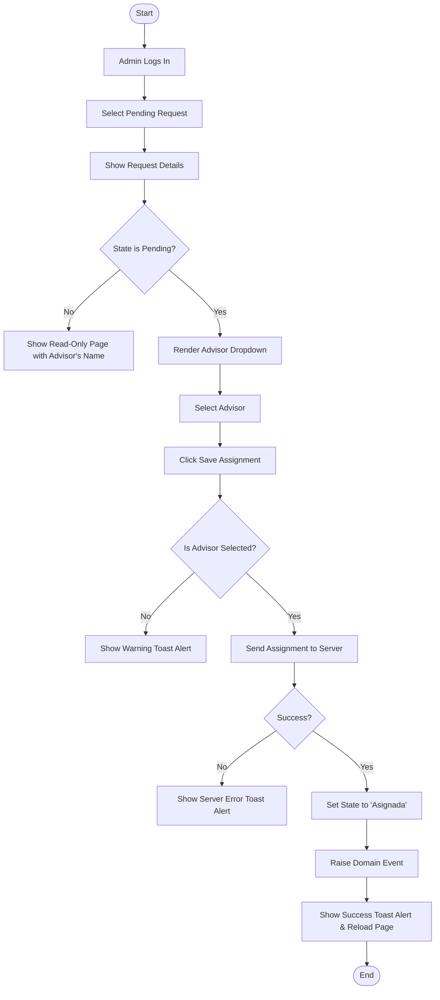
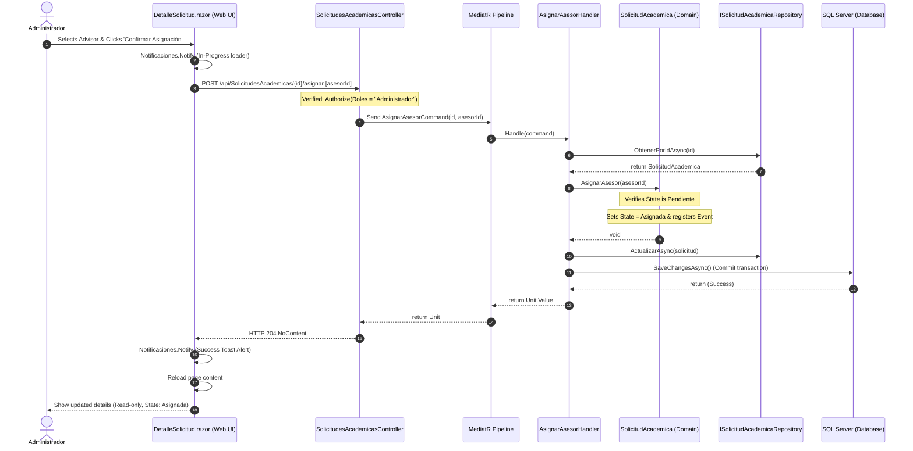

# Use Case: Asignar Solicitud Manualmente (Manual Request Assignment)

## 👥 Functional Perspective (User Manual)

### Goal
This usecase allows system **Administrators** to review incoming academic requests in the **Pendiente** (Pending) state and manually assign a qualified professional **Colaborador / Asesor** (Advisor) to fulfill the requirements. This initiates the workflow, moving the request to an **Asignada** (Assigned) status, enabling the advisor to see it on their dashboard, and letting the client know an advisor has been chosen.

### Actors
* **Administrador** (Administrator): Authorized to perform manual assignments.
* **Cliente / Estudiante** (Client / Student): Can view the assignment details in Read-Only mode.
* **Colaborador / Asesor** (Advisor): Can view the assignment details in Read-Only mode.

### Usage Guide

#### For Administrators (Performing the Assignment)
1. Navigate to the **Home Dashboard**.
2. Select any request displaying a status badge of **Pendiente** (Pending).
3. On the details page, an exclusive interactive panel titled **"Asignación Manual de Asesor"** will be displayed.
4. Open the dropdown menu containing all active, approved advisors in the system.
5. Choose the desired advisor from the list.
6. Click the **"Confirmar Asignación"** (Confirm Assignment) button.
7. A sleek toast notification will appear in the top-right corner validating the success of the operation.
8. The page will instantly reload, displaying the request status as **Asignada** (Assigned) and rendering the page in secure Read-Only mode.

#### For Clients and Advisors (Viewing the Assignment)
1. Click on the academic request from the **Home Dashboard**.
2. You will be redirected to the request details page.
3. The page is presented in a strict **Read-Only** view:
   * No dropdown list or buttons will be displayed.
   * A premium advisor profile badge will show either the name of the assigned professional (e.g., *"Asesor Encargado: Usuario de Prueba"*) or a message indicating *"Pendiente de Asignación"* (Awaiting Advisor Assignment).

### Business Rules
* **Role Restricting:** Only accounts with the `Administrador` role can see or execute the manual assignment control panel.
* **Status Invariant:** Assignment is only permitted when the request is strictly in the `Pendiente` (Pending, value `1`) state.
* **Advisor Verification:** Only approved and active academic advisors registered with a valid professional profile (`PerfilColaborador`) can be assigned to a request.
* **Domain Propagation:** A successful assignment triggers a `SolicitudAsignadaDomainEvent` which propagates state updates throughout the system.

### Process Flowchart



---

## 💻 Technical Perspective (Developer Guide)

### File Map

| Layer | Project | File / Path | Responsibility |
| :--- | :--- | :--- | :--- |
| **Presentation** | `GrupoXpert.Web` | [`DetalleSolicitud.razor`](file:///e:/Documentos/Proyectos/GrupoXpert/Src/GrupoXpert/GrupoXpert.Web/Components/Pages/DetalleSolicitud.razor) | Web Blazor Page rendering request specifications, verifying Admin role, hosting the `<RadzenDropDown>` search selector, and handling saves with toast alerts. |
| **Presentation** | `GrupoXpert.Maui` | [`DetalleSolicitud.razor`](file:///e:/Documentos/Proyectos/GrupoXpert/Src/GrupoXpert/GrupoXpert.Maui/Components/Pages/DetalleSolicitud.razor) | Mobile Blazor Hybrid Page rendering mobile-optimized Read-Only view with notch safe-area handling. |
| **Shared UI** | `GrupoXpert.Shared.UI` | [`ISolicitudAcademicaService.cs`](file:///e:/Documentos/Proyectos/GrupoXpert/Src/GrupoXpert/GrupoXpert.Shared.UI/Abstracciones/ISolicitudAcademicaService.cs) | Service abstraction providing API access contracts (`ObtenerPorIdAsync` and `AsignarAsesorAsync`). |
| **Application** | `GrupoXpert.Application` | [`AsignarAsesorCommand.cs`](file:///e:/Documentos/Proyectos/GrupoXpert/Src/GrupoXpert/GrupoXpert.Application/Academia/Commands/AsignarAsesorCommand.cs) | MediatR request command representing the assignment intention. |
| **Application** | `GrupoXpert.Application` | [`AsignarAsesorHandler.cs`](file:///e:/Documentos/Proyectos/GrupoXpert/Src/GrupoXpert/GrupoXpert.Application/Academia/Commands/AsignarAsesorHandler.cs) | Command handler fetching the aggregate, running business logic, and executing DB persistence. |
| **Application** | `GrupoXpert.Application` | [`ObtenerSolicitudPorIdQuery.cs`](file:///e:/Documentos/Proyectos/GrupoXpert/Src/GrupoXpert/GrupoXpert.Application/Academia/Queries/ObtenerSolicitudPorIdQuery.cs) | MediatR query to fetch a single request record. |
| **Application** | `GrupoXpert.Application` | [`ObtenerSolicitudPorIdHandler.cs`](file:///e:/Documentos/Proyectos/GrupoXpert/Src/GrupoXpert/GrupoXpert.Application/Academia/Queries/ObtenerSolicitudPorIdHandler.cs) | Query handler retrieving request details and resolving/mapping the advisor's full name. |
| **Application** | `GrupoXpert.Application` | [`SolicitudAcademicaDto.cs`](file:///e:/Documentos/Proyectos/GrupoXpert/Src/GrupoXpert/GrupoXpert.Application/Academia/Dtos/SolicitudAcademicaDto.cs) | Data Transfer Object mapping request fields and including `NombreAsesor`. |
| **Domain** | `GrupoXpert.Domain` | [`SolicitudAcademica.cs`](file:///e:/Documentos/Proyectos/GrupoXpert/Src/GrupoXpert/GrupoXpert.Domain/Academia/SolicitudAcademica.cs) | Aggregate Root maintaining business rules in `AsignarAsesor()`, setting status to `Asignada`, and registering the domain event. |
| **Domain** | `GrupoXpert.Domain` | [`EstadoSolicitud.cs`](file:///e:/Documentos/Proyectos/GrupoXpert/Src/GrupoXpert/GrupoXpert.Domain/Academia/EstadoSolicitud.cs) | Status enum extended with `Asignada = 5`. |
| **Domain** | `GrupoXpert.Domain` | [`SolicitudAsignadaDomainEvent.cs`](file:///e:/Documentos/Proyectos/GrupoXpert/Src/GrupoXpert/GrupoXpert.Domain/Academia/Events/SolicitudAsignadaDomainEvent.cs) | Domain Event record signaling successful advisor assignment. |
| **WebApi (API)** | `GrupoXpert.WebApi` | [`SolicitudesAcademicasController.cs`](file:///e:/Documentos/Proyectos/GrupoXpert/Src/GrupoXpert/GrupoXpert.WebApi/Controllers/SolicitudesAcademicasController.cs) | Web API Controller exposing REST endpoints protected via `[Authorize]`. |
| **Database** | MS SQL Server | `[Academia].[SolicitudesAcademicas]` | Physical table containing the foreign key `AsesorId` pointing to `PerfilesColaboradores` and column `Estado` (value 5). |

### Data Contract

```csharp
namespace GrupoXpert.Application.Academia.Commands;

public record AsignarAsesorCommand(
    Guid SolicitudId,
    Guid AsesorId
) : IRequest<Unit>;
```

### Domain Logic

The core invariants are encapsulated directly in the `SolicitudAcademica` Aggregate Root:

```csharp
public void AsignarAsesor(Guid asesorId)
{
    if (asesorId == Guid.Empty)
    {
        throw new ArgumentException("El ID del asesor no puede estar vacío.", nameof(asesorId));
    }

    if (Estado != EstadoSolicitud.Pendiente)
    {
        throw new Exceptions.ExcepcionDominio("Solo se pueden asignar asesores a solicitudes pendientes.");
    }

    AsesorId = asesorId;
    Estado = EstadoSolicitud.Asignada;

    AgregarEventoDominio(new SolicitudAsignadaDomainEvent(Id, asesorId));
}
```

### Data Flow & Sequence Diagram

The following diagram illustrates the structural communication across projects and layers upon confirming assignment:


