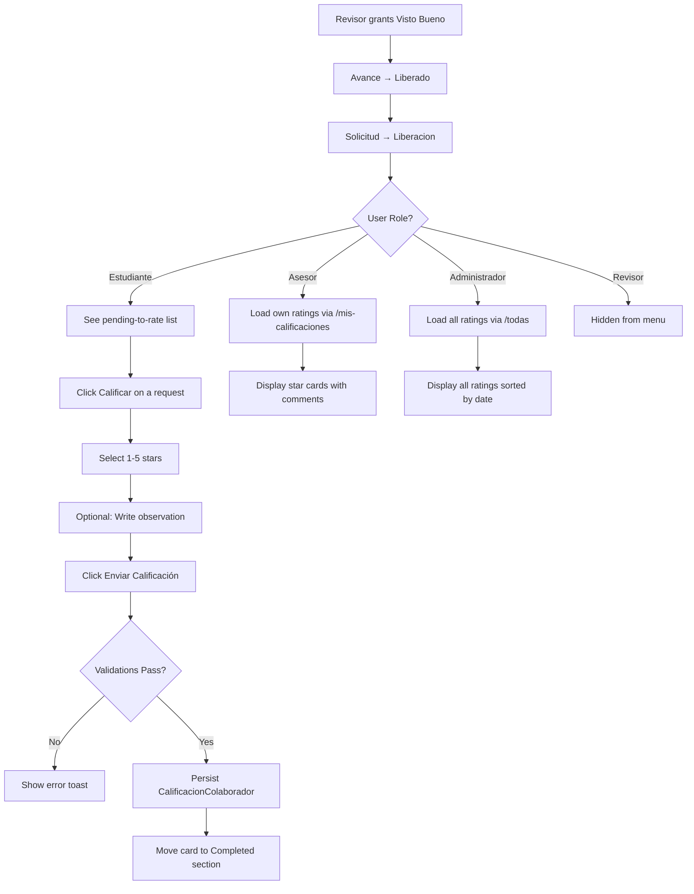
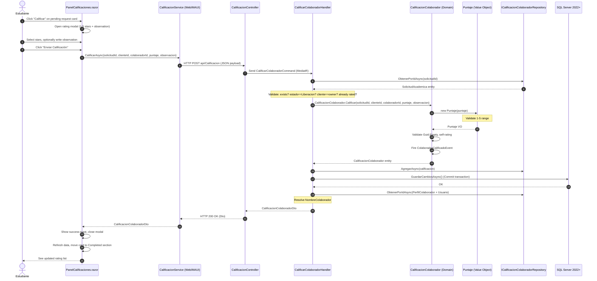
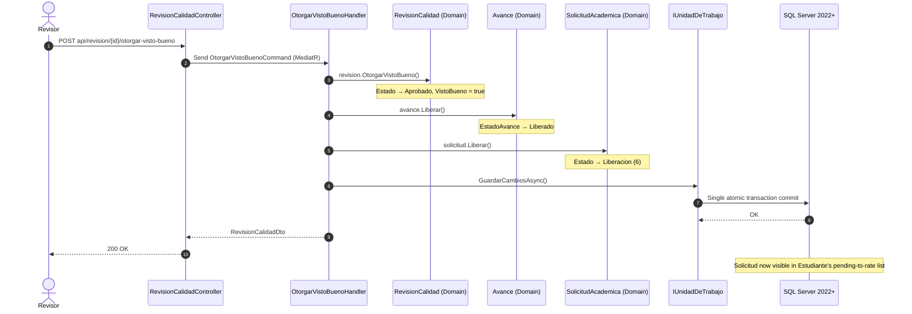

# Use Case: Rate Service & Collaborator (Evaluation System)

## 👥 Functional Perspective (User Manual)

### Goal
Enable students (Clientes) to evaluate the work of their assigned collaborators (Asesores) using a 1-5 star rating system with optional written feedback. Collaborators can review their own ratings, while Administrators can monitor all ratings across the platform for quality assurance and reputation management.

### Actors

| Actor | Access Level | What They Can Do |
| :--- | :--- | :--- |
| **Student (Estudiante)** | Own requests | Rate collaborators whose final deliverables have passed quality review. See both pending and completed ratings. |
| **Collaborator (Asesor)** | Own ratings | View all ratings received from clients, including stars, comments, and dates. |
| **Administrator (Administrador)** | All ratings | View every rating in the system. Manually liberate a solicitud if needed. |
| **Reviewer (Revisor)** | None | No access to the Calificaciones module. |

### Precondition: How a Request Becomes Rateable
The rating flow is triggered automatically by the quality assurance pipeline:

1. A **Revisor** reviews the final deliverable and grants **Visto Bueno** (passes quality check).
2. The **Avance** (deliverable) transitions to `Liberado` (Released) state.
3. The **Solicitud Academica** automatically transitions to `Liberacion` (Release) state (`EstadoSolicitud.Liberacion = 6`).
4. The solicitud now appears in the student's **"Pending to Rate"** list.

### Usage Guide

#### A. Student (Estudiante) — Rate a Collaborator
1. Navigate to **Home** and click the **"Calificaciones"** tab in the quick-access menu (star icon).
2. The panel shows two sections:
   - **Pendientes por calificar**: Requests awaiting your rating with collaborator name, topic area, and a yellow "Sin calificar" chip.
   - **Calificaciones realizadas**: Previously rated requests shown with star display, score (X/5), date, and any comment you left.
3. Click the **"Calificar"** button on any pending request card.
4. A modal opens showing the request topic and collaborator name.
5. **Hover and click** the stars to select your rating (1-5). The hover effect previews your selection and descriptive labels appear: *Muy malo (1), Malo (2), Regular (3), Bueno (4), Excelente (5)*.
6. Optionally write an **observation** describing your experience with the collaborator.
7. Click **"Enviar Calificación"**. A success toast confirms the rating was registered.
8. The card moves from "Pending" to "Completed" section immediately.

#### B. Collaborator (Asesor) — View Own Ratings
1. Navigate to **Home** and click the **"Calificaciones"** tab (trophy icon).
2. The panel displays all ratings received, ordered by most recent.
3. Each card shows: star rating (1-5), score (X/5), client comment (if any), and date.
4. An empty state message (*"Aún no has recibido calificaciones de los clientes"*) appears if no ratings exist yet.

#### C. Administrator (Administrador) — View All Ratings
1. Navigate to **Home** and click the **"Calificaciones"** tab (admin icon).
2. The panel displays every rating in the system, ordered by most recent, with collaborator name, stars, comments, and dates.
3. An empty state message (*"Aún no hay calificaciones registradas en el sistema"*) appears if no ratings exist yet.

### Golden Rules (Business Validations)
- **Only the client** who owns the solicitud can rate its collaborator.
- **Self-rating is forbidden**: A user cannot rate themselves.
- **One rating per solicitud**: Duplicate ratings are prevented (enforced by unique constraint on `SolicitudId`).
- **State gating**: The solicitud must be in `Liberacion` state to be rateable.
- **Star range**: `Puntaje` must be between 1 and 5 (inclusive). Enforced in domain and database CHECK constraint.
- **Observacion** is optional. Whitespace-only comments are trimmed to null.

### Process Flowchart


---

## 💻 Technical Perspective (Developer Guide)

### Component Map

| Layer | Project | File | Responsibility |
| :--- | :--- | :--- | :--- |
| **Domain — Entity** | `GrupoXpert.Domain` | `Calificacion/CalificacionColaborador.cs` | Aggregate Root: `Calificar()` factory, self-rating prevention, `Puntaje` VO creation, `ColaboradorCalificadoEvent` generation, `ActualizarObservacion()`. |
| **Domain — Value Object** | `GrupoXpert.Domain` | `Calificacion/Puntaje.cs` | Value Object 1-5 stars. Enforces range validation, provides named constructors (`UnaEstrella`..`CincoEstrellas`), implements structural equality. |
| **Domain — Event** | `GrupoXpert.Domain` | `Calificacion/Events/ColaboradorCalificadoEvent.cs` | Domain event fired upon successful rating: `CalificacionId`, `SolicitudId`, `ClienteId`, `ColaboradorId`, `Puntaje`, `FechaOcurrencia`. |
| **Domain — Repository** | `GrupoXpert.Domain` | `Calificacion/ICalificacionColaboradorRepository.cs` | Interface: `ObtenerPorIdAsync`, `ObtenerPorSolicitudAsync`, `AgregarAsync`, `ActualizarAsync`, `ObtenerPorClienteAsync`, `ObtenerPorColaboradorAsync`, `ObtenerTodasAsync`. |
| **Domain — Solicitud Liberar** | `GrupoXpert.Domain` | `Academia/SolicitudAcademica.cs` | `Liberar()` method: guards state `Asignada` or `EnProceso`, sets `Estado = EstadoSolicitud.Liberacion`. |
| **Domain — Estado Enum** | `GrupoXpert.Domain` | `Academia/EstadoSolicitud.cs` | `Liberacion = 6` as a first-class state in the enum. |
| **Domain — Avance Liberar** | `GrupoXpert.Domain` | `Academia/Avance.cs` | `Liberar()` on `Avance`: only applies to `TipoAvance.Final` with state `PendienteRevision` or `Aprobado`, sets `EstadoAvance.Liberado`. |
| **Domain — Quality Revision** | `GrupoXpert.Domain` | `Calidad/RevisionCalidad.cs` | `OtorgarVistoBueno()`: validates `Pendiente`, sets `VistoBueno = true`, `Estado = Aprobado`, fires `VistoBuenoOtorgadoEvent`. |
| **Domain — Repository Ext** | `GrupoXpert.Domain` | `Academia/ISolicitudAcademicaRepository.cs` | `ObtenerEnLiberacionPorClienteAsync(clienteId)`, `ObtenerEnLiberacionAsync()` — queries for solicitudes in Liberacion state. |
| **Application — Command** | `GrupoXpert.Application` | `Calificacion/Commands/CalificarColaboradorCommand.cs` | MediatR command: `SolicitudId`, `ClienteId`, `ColaboradorId`, `Puntaje (int 1-5)`, `Observacion?`. Returns `CalificacionColaboradorDto`. |
| **Application — Handler** | `GrupoXpert.Application` | `Calificacion/Commands/CalificarColaboradorHandler.cs` | Orchestration: validates solicitud exists, is in `Liberacion`, belongs to client, not already rated. Calls domain factory, persists, resolves collaborator name from `PerfilColaborador→Usuario`, returns DTO. |
| **Application — Query** | `GrupoXpert.Application` | `Calificacion/Queries/ObtenerSolicitudesPorCalificarQuery.cs` | Query + Handler: resolves `PerfilCliente` from `UsuarioId`, fetches solicitudes in `Liberacion` for that client, enriches with asesor name and rating status. |
| **Application — Query** | `GrupoXpert.Application` | `Calificacion/Queries/ObtenerMisCalificacionesQuery.cs` | Query + Handler: resolves `PerfilColaborador` from `UsuarioId`, fetches ratings for that collaborator, enriches with name. Used by Asesor role. |
| **Application — Query** | `GrupoXpert.Application` | `Calificacion/Queries/ObtenerCalificacionPorSolicitudQuery.cs` | Query + Handler: returns `CalificacionColaboradorDto?` for a given `SolicitudId`. |
| **Application — Query** | `GrupoXpert.Application` | `Calificacion/Queries/ObtenerCalificacionesPorColaboradorQuery.cs` | Query + Handler: returns all ratings for a given `ColaboradorId`. Admin-only. |
| **Application — Query** | `GrupoXpert.Application` | `Calificacion/Queries/ObtenerTodasCalificacionesQuery.cs` | Query + Handler: returns all ratings in the system. No parameters. Admin-only. |
| **Application — Command** | `GrupoXpert.Application` | `Academia/Commands/LiberarSolicitudCommand.cs` | MediatR command: `LiberarSolicitudCommand(SolicitudId)`. Manually transitions solicitud to `Liberacion`. |
| **Application — Handler** | `GrupoXpert.Application` | `Academia/Commands/LiberarSolicitudHandler.cs` | Fetches solicitud, calls `solicitud.Liberar()`, persists. |
| **Application — Command** | `GrupoXpert.Application` | `Calidad/Commands/OtorgarVistoBuenoCommand.cs` | MediatR command: `OtorgarVistoBuenoCommand(RevisionId)`. Triggers the VistoBueno → Liberacion chain. |
| **Application — Handler** | `GrupoXpert.Application` | `Calidad/Commands/OtorgarVistoBuenoHandler.cs` | Atomically: calls `revision.OtorgarVistoBueno()`, `avance.Liberar()`, `solicitud.Liberar()`, then commits in a single UoW transaction. |
| **Application — DTO** | `GrupoXpert.Application` | `Calificacion/Dtos/CalificacionColaboradorDto.cs` | Data transfer record: `Id`, `SolicitudId`, `ClienteId`, `ColaboradorId`, `NombreColaborador?`, `Puntaje`, `Observacion?`, `FechaCalificacion`. |
| **Application — DTO** | `GrupoXpert.Application` | `Calificacion/Dtos/SolicitudPorCalificarDto.cs` | Data transfer record: `SolicitudId`, `ClienteId`, `AreaTematica`, `Estado`, `AsesorId?`, `NombreAsesor?`, `Calificada`, `Puntaje?`, `ObservacionCalificacion?`, `FechaCalificacion?`. |
| **Infrastructure — EF Config** | `GrupoXpert.Infrastructure` | `Persistence/Configurations/CalificacionColaboradorConfiguracion.cs` | Maps to `[Calificacion].[CalificacionesColaborador]`. `Puntaje` as owned VO (column `Puntaje`, required). `Observacion` max 1000 chars. Unique index on `SolicitudId`. FKs to `SolicitudAcademica`, `PerfilCliente`, `PerfilColaborador` with `Restrict` delete. Ignores domain events. |
| **Infrastructure — Repository** | `GrupoXpert.Infrastructure` | `Persistence/Repositories/CalificacionColaboradorRepository.cs` | Implements `ICalificacionColaboradorRepository`. All 7 methods ordered by `FechaCalificacion` descending. |
| **Infrastructure — Solicitud Repo** | `GrupoXpert.Infrastructure` | `Persistence/Repositories/SolicitudAcademicaRepository.cs` | Implements `ObtenerEnLiberacionPorClienteAsync` and `ObtenerEnLiberacionAsync` filtering by `Estado == EstadoSolicitud.Liberacion`. |
| **Infrastructure — DI** | `GrupoXpert.Infrastructure` | `DependencyInjection.cs` | Registers `ICalificacionColaboradorRepository → CalificacionColaboradorRepository`. |
| **WebApi — Controller** | `GrupoXpert.WebApi` | `Controllers/CalificacionController.cs` | 7 endpoints at `api/Calificacion`. See endpoint table below. |
| **Shared.UI — Interface** | `GrupoXpert.Shared.UI` | `Abstracciones/ICalificacionService.cs` | Frontend service contract: `CalificarAsync`, `ObtenerSolicitudesPorCalificarAsync`, `ObtenerPorSolicitudAsync`, `ObtenerPorColaboradorAsync`, `ObtenerMisCalificacionesAsync`, `ObtenerTodasAsync`, `LiberarSolicitudAsync`. |
| **Shared.UI — Models** | `GrupoXpert.Shared.UI` | `Modelos/Calificacion/CalificacionModelos.cs` | Client-side DTO records mirroring Application-layer DTOs. |
| **Shared.UI — Panel** | `GrupoXpert.Shared.UI` | `Componentes/Calificacion/PanelCalificaciones.razor` | Core UI component. Parameters: `EsEstudiante`, `EsAdministrador`, `EsAsesor`. Three role-based views: pending+completed for students, rating cards for asesor/admin. Star rating modal with hover effect, observation text area, loading skeletons, empty states. |
| **Shared.UI — Menu** | `GrupoXpert.Shared.UI` | `Componentes/Layout/MenuRapido.razor` | Registers "Calificaciones" menu item (icon `grade`, route `/calificaciones`) visible to `Estudiante`, `Asesor`, `Administrador`. Hidden from Revisor. |
| **Web — Page** | `GrupoXpert.Web` | `Components/Pages/Calificaciones.razor` | `/calificaciones` route, `InteractiveServer`, `[Authorize]`. Reads role from `AuthenticationState`, passes booleans to `<PanelCalificaciones>`. |
| **Web — Service** | `GrupoXpert.Web` | `Services/CalificacionService.cs` | Implements `ICalificacionService`. Uses `HttpClient` + `IHttpContextAccessor` for JWT from cookie. Calls all 7 controller endpoints. |
| **Web — Home** | `GrupoXpert.Web` | `Components/Pages/Home.razor` | Maps `EstadoSolicitud.Liberacion = 6` to amber color `#f59e0b`, text "Liberacion", icon `verified` in dashboard card state helpers. |
| **Web — DI** | `GrupoXpert.Web` | `Program.cs` | Registers `ICalificacionService → CalificacionService`. |
| **MAUI — Page** | `GrupoXpert.Maui` | `Components/Pages/Calificaciones.razor` | `/calificaciones` route. Reads role from JWT stored in `Preferences`, parses JSON payload, passes booleans to `<PanelCalificaciones>`. |
| **MAUI — Service** | `GrupoXpert.Maui` | `Services/CalificacionService.cs` | Implements `ICalificacionService`. Uses `Preferences.Default.Get("authToken", ...)` for JWT instead of `IHttpContextAccessor`. |
| **MAUI — Home** | `GrupoXpert.Maui` | `Components/Pages/Home.razor` | Same state mappings as Web Home: `Liberacion=6` → amber, "Liberacion", `verified`. |
| **MAUI — Tab Bar** | `GrupoXpert.Maui` | `Components/Layout/MainLayout.razor` | Bottom tab bar: replaced "Publicar" tab with "Calificaciones" tab (hidden for Revisor role). |
| **MAUI — DI** | `GrupoXpert.Maui` | `MauiProgram.cs` | Registers `ICalificacionService → CalificacionService`. |
| **SQL — DDL** | `docs/sql/` | `CalificacionesColaborador.sql` | Schema `[Calificacion]`, table `[Calificacion].[CalificacionesColaborador]` with PK, UQ on `SolicitudId`, CHECK(1-5), FKs to `SolicitudesAcademicas`, `PerfilesCliente`, `PerfilesColaboradores`, indexes on `ClienteId` and `ColaboradorId`. Migration block for legacy FK correction. |

### Data Contracts & API Endpoints

All endpoints are on `api/Calificacion`.

| Method | Route | Authorization | Command/Query | Input | Output |
| :--- | :--- | :--- | :--- | :--- | :--- |
| `POST` | `/` | `Estudiante` | `CalificarColaboradorCommand` | JSON body with `solicitudId`, `clienteId`, `colaboradorId`, `puntaje`, `observacion` | `CalificacionColaboradorDto` (201) |
| `GET` | `/solicitudes-por-calificar` | `Estudiante` | `ObtenerSolicitudesPorCalificarQuery` | UserId from JWT claim | `IReadOnlyList<SolicitudPorCalificarDto>` |
| `GET` | `/solicitud/{solicitudId}` | Any authenticated | `ObtenerCalificacionPorSolicitudQuery` | `solicitudId` in URL path | `CalificacionColaboradorDto?` or 404 |
| `GET` | `/colaborador/{colaboradorId}` | `Administrador` | `ObtenerCalificacionesPorColaboradorQuery` | `colaboradorId` in URL path | `IReadOnlyList<CalificacionColaboradorDto>` |
| `GET` | `/mis-calificaciones` | `Asesor` | `ObtenerMisCalificacionesQuery` | UserId from JWT claim | `IReadOnlyList<CalificacionColaboradorDto>` |
| `GET` | `/todas` | `Administrador` | `ObtenerTodasCalificacionesQuery` | None | `IReadOnlyList<CalificacionColaboradorDto>` |
| `POST` | `/solicitud/{solicitudId}/liberar` | `Administrador` | `LiberarSolicitudCommand` | `solicitudId` in URL path | 204 No Content |

#### Request Payload: `POST api/Calificacion`
```json
{
  "solicitudId": "3fa85f64-5717-4562-b3fc-2c963f66afa6",
  "clienteId": "e3052824-774f-4d32-aa7c-cfd9d20c570b",
  "colaboradorId": "a1b2c3d4-5678-90ab-cdef-1234567890ab",
  "puntaje": 5,
  "observacion": "Excellent work on the thesis methodology chapter. Very professional."
}
```

#### Response: `CalificacionColaboradorDto`
```json
{
  "id": "abc12345-def6-7890-abcd-ef1234567890",
  "solicitudId": "3fa85f64-5717-4562-b3fc-2c963f66afa6",
  "clienteId": "e3052824-774f-4d32-aa7c-cfd9d20c570b",
  "colaboradorId": "a1b2c3d4-5678-90ab-cdef-1234567890ab",
  "nombreColaborador": "Carlos Asesor",
  "puntaje": 5,
  "observacion": "Excellent work on the thesis methodology chapter.",
  "fechaCalificacion": "2026-06-10T15:30:00+00:00"
}
```

#### Response: `SolicitudPorCalificarDto`
```json
{
  "solicitudId": "3fa85f64-5717-4562-b3fc-2c963f66afa6",
  "clienteId": "e3052824-774f-4d32-aa7c-cfd9d20c570b",
  "areaTematica": "Inteligencia Artificial",
  "estado": 6,
  "asesorId": "a1b2c3d4-5678-90ab-cdef-1234567890ab",
  "nombreAsesor": "Carlos Asesor",
  "calificada": false,
  "puntaje": null,
  "observacionCalificacion": null,
  "fechaCalificacion": null
}
```

### Domain Logic Deep Dive

#### `CalificacionColaborador.Calificar()` — Aggregate Root Factory (`CalificacionColaborador.cs:36`)
```csharp
public static CalificacionColaborador Calificar(
    Guid solicitudId, Guid clienteId, Guid colaboradorId, int puntaje, string? observacion)
```
**Invariants enforced:**
1. `solicitudId` must not be `Guid.Empty` — throws `ArgumentException`
2. `clienteId` must not be `Guid.Empty` — throws `ArgumentException`
3. `colaboradorId` must not be `Guid.Empty` — throws `ArgumentException`
4. `clienteId != colaboradorId` — prevents self-rating; throws `ExcepcionDominio`
5. `Puntaje` Value Object validates 1-5 internally — throws `ExcepcionDominio` if out of range
6. `Observacion` trims whitespace; converts whitespace-only strings to `null`
7. Fires `ColaboradorCalificadoEvent` domain event

#### `Puntaje` — Value Object (`Puntaje.cs`)
- Immutable, with structural equality via `ObtenerComponentesIgualdad()`
- Static named constructors: `Puntaje.UnaEstrella` through `Puntaje.CincoEstrellas`
- `Valor` property exposes the underlying `int`
- Range guard in constructor: `if (valor < 1 || valor > 5) throw new ExcepcionDominio(...)`

#### `SolicitudAcademica.Liberar()` — State Transition (`SolicitudAcademica.cs:186`)
- Guards: solicitud must be in `Asignada` or `EnProceso` state
- Sets `Estado = EstadoSolicitud.Liberacion`
- Called by `OtorgarVistoBuenoHandler` (automatic) or `LiberarSolicitudHandler` (manual admin override)

### Sequence Diagram: Student Rates a Collaborator



### Sequence Diagram: Automatic Liberacion Chain (VistoBueno → Liberacion)



### Database Physical Model

| Table | Schema | Key Columns | Constraints |
| :--- | :--- | :--- | :--- |
| `CalificacionesColaborador` | `Calificacion` | `Id` (PK), `SolicitudId`, `ClienteId`, `ColaboradorId`, `Puntaje`, `Observacion`, `FechaCalificacion` | `PK_CalificacionesColaborador`, `UQ_CalificacionesColaborador_Solicitud` (unique on `SolicitudId`), `CK_CalificacionesColaborador_Puntaje` (`CHECK 1-5`), `FK_CalificacionesColaborador_SolicitudesAcademicas`, `FK_CalificacionesColaborador_PerfilesCliente`, `FK_CalificacionesColaborador_PerfilesColaborador`, `IX_CalificacionesColaborador_ClienteId` (nonclustered), `IX_CalificacionesColaborador_ColaboradorId` (nonclustered) |

> **Historical note**: The `ClienteId` and `ColaboradorId` foreign keys previously referenced `[Identidad].[Usuarios]` but were refactored to reference `[Perfil].[PerfilesCliente]` and `[Perfil].[PerfilesColaboradores]` respectively, aligning with the DDD identity/perfil separation. The SQL script includes a migration block to safely drop old FKs and create new ones.

### Unit Test Coverage (50 tests, all passing)

| Test File | Tests | Coverage Area |
| :--- | :--- | :--- |
| `PuntajeTests.cs` | 10 | Range 1-5, out-of-range (0, -1, 6, 10, 100), named constructors, structural equality |
| `CalificacionColaboradorTests.cs` | 14 | Successful creation, null/whitespace/trimmed observations, puntaje 1-5 range, fecha generation, domain event, empty Guid validation, self-rating prevention, `ActualizarObservacion` |
| `CalificarColaboradorHandlerTests.cs` | 10 | Happy path, name resolution, missing perfil (null name), solicitud not found, state gating (Pendiente/Asignada/Cancelada), wrong client ownership, duplicate prevention |
| `ObtenerSolicitudesPorCalificarHandlerTests.cs` | 2 | Retrieval with empty list, perfil cliente not found |
| `ObtenerMisCalificacionesHandlerTests.cs` | 3 | Successful retrieval with name, empty list, perfil not found |
