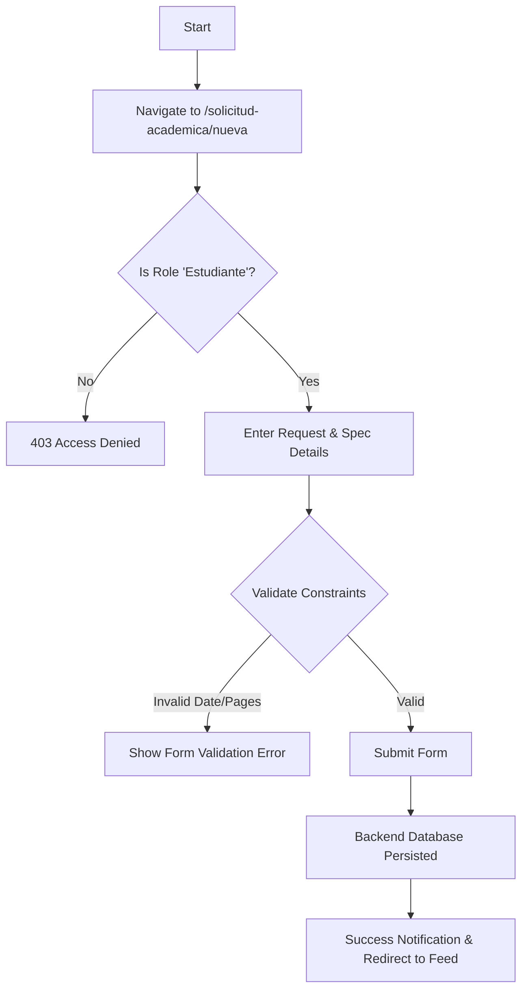
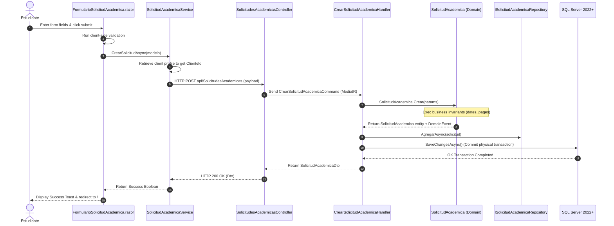

# Use Case: Create Custom Academic Request

## 👥 Functional Perspective (User Manual)

### Goal
Allow an authenticated student (Cliente) to submit a personalized academic request for a customized job (e.g. essays, thesis, articles, or presentations), providing all details, formatting preferences, urgency options, and base instructions. This serves as the initial trigger for the academic writing services workflow.

### Actors
- **Student (Cliente/Estudiante)**: The only actor authorized to create and submit academic requests. 
- *Unauthorized Actors*: Administrators, advisors, and collaborators are restricted from submitting academic requests to avoid conflicts of interest.

### Usage Guide
1. **Navigate to Portal**: Authenticated students click on the **"Nueva Solicitud"** button located on the top navbar.
2. **Step 1: Project Details**:
   - Select the academic level: Secondary, Undergraduate (Pregrado), Specialization (Especialización), Master (Maestría), or Doctorate (Doctorado).
   - Select the type of work: Essay, Thesis, Article, Monograph, Degree Project, Summary, Presentation, or Other.
   - Type in the thematic area / knowledge field of the request.
3. **Step 2: Format and Specs**:
   - Provide the estimated count of pages or words.
   - Choose the preferred citation standard (APA, IEEE, Vancouver, Chicago, Harvard, or Other).
   - Choose the target language of the paper (Spanish, English, Portuguese, French, or Other).
   - Provide explicit layout formatting details (e.g., Font Arial 12, double spaced).
4. **Step 3: Planning & Files**:
   - Choose a target delivery deadline (Fecha de entrega) from the calendar.
   - Describe in detail or paste links to teachers' instruction documents or baseline reading files (Material Base).
5. **Step 4: Premium Preferences**:
   - Toggle **"Es Urgente"** if the request demands immediate scheduling.
   - Toggle **"Entrega por Fases"** if the request will be delivered and paid in incremental steps.
6. **Submit**: Click **"ENVIAR SOLICITUD"**. The system validates inputs and redirects to the home feed showing success notification.

### Golden Rules (Business Validations)
- The delivery date (`FechaEntrega`) cannot be in the past.
- The estimated pages/words (`NumeroPaginasOPalabras`) must be greater than zero.
- The thematic area (`AreaTematica`) cannot be empty or whitespaced.
- Only users authenticating with the `Estudiante` role are authorized to submit.

### Process Flowchart


---

## 💻 Technical Perspective (Developer Guide)

### Component Map

| Layer | Project | File | Responsibility |
| :--- | :--- | :--- | :--- |
| **Presentation (UI)** | `GrupoXpert.Shared.UI` | `Componentes/Academia/FormularioSolicitudAcademica.razor` | Radzen form component handling data binding, client-side validation, and submit trigger. |
| **Presentation (Web Page)** | `GrupoXpert.Web` | `Components/Pages/NuevaSolicitud.razor` | Web router container page `/solicitud-academica/nueva` secured via `[Authorize(Roles = "Estudiante")]`. |
| **UI Abstractions** | `GrupoXpert.Shared.UI` | `Abstracciones/ISolicitudAcademicaService.cs` | Interface defining frontend service contract for sending requests. |
| **UI Models** | `GrupoXpert.Shared.UI` | `Modelos/Academia/SolicitudAcademicaModelo.cs` | UI data binding model with DataAnnotation attributes for validation. |
| **UI Implementations** | `GrupoXpert.Web` | `Services/SolicitudAcademicaService.cs` | Fetches client profile, extracts `ClienteId`, maps inputs, and calls backend API. |
| **WebApi Endpoint** | `GrupoXpert.WebApi` | `Controllers/SolicitudesAcademicasController.cs` | Controller exposed at `api/SolicitudesAcademicas`, accepts HTTP POST payloads. |
| **Application Layer** | `GrupoXpert.Application` | `Academia/Commands/CrearSolicitudAcademicaCommand.cs` | MediatR input command containing request attributes. |
| **Application Layer** | `GrupoXpert.Application` | `Academia/Commands/CrearSolicitudAcademicaHandler.cs` | Executes use-case orchestrations, triggers domain entity factories, and calls repository. |
| **Application Layer** | `GrupoXpert.Application` | `Academia/Dtos/SolicitudAcademicaDto.cs` | Data transfer record returned to UI clients. |
| **Domain Model** | `GrupoXpert.Domain` | `Academia/SolicitudAcademica.cs` | Aggregate Root executing business validations and raising domain events. |
| **Domain Events** | `GrupoXpert.Domain` | `Academia/Events/SolicitudAcademicaCreadaDomainEvent.cs` | Event notifying system of a newly registered academic request. |
| **Infrastructure Layer** | `GrupoXpert.Infrastructure` | `Persistence/Configurations/SolicitudAcademicaConfiguracion.cs` | Maps aggregate properties to physical SQL database columns using EF Core Fluent API. |
| **Infrastructure Layer** | `GrupoXpert.Infrastructure` | `Persistence/AppDbContext.cs` | Context exposes `DbSet<SolicitudAcademica>`. |
| **Database Physical Schema** | SQL Server 2022+ | `docs/sql/SolicitudesAcademicas.sql` | DDL script for table `[Academia].[SolicitudesAcademicas]` with schema indices and Foreign Keys. |

### Data Flow & Data Contracts
The UI captures `SolicitudAcademicaModelo` and maps it via `SolicitudAcademicaService` to trigger a REST POST request.

#### Endpoint Contract: `POST api/SolicitudesAcademicas`
**Request Payload:**
```json
{
  "clienteId": "e3052824-774f-4d32-aa7c-cfd9d20c570b",
  "nivelAcademico": 1,
  "tipoTrabajo": 0,
  "areaTematica": "Desarrollo de Software Distribuido",
  "fechaEntrega": "2026-05-26T00:00:00Z",
  "numeroPaginasOPalabras": 15,
  "normaCitacion": 0,
  "idioma": 0,
  "formatoRequerido": "Letra Times New Roman 12, interlineado doble",
  "materialBase": "Seguir pautas de rúbrica en PDF adjunto en este link: http://...",
  "esUrgente": false,
  "entregaPorFases": true
}
```

### Sequence Diagram

