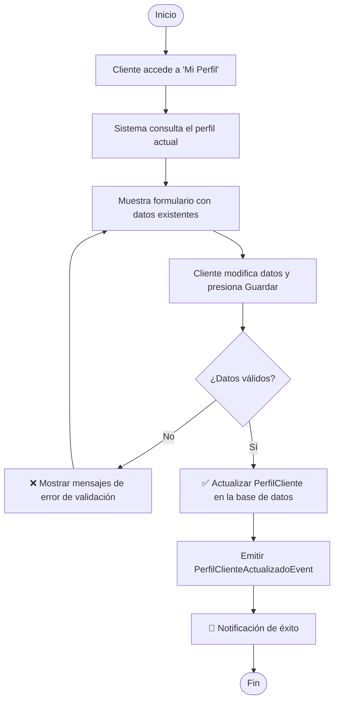

# Caso de Uso: Gestionar Perfil de Cliente (Preferencias académicas)

> **Módulo:** Perfil | **Contexto:** PERFIL | **Versión:** 1.0 | **Autor:** GrupoXpert Dev Team  
> **Última actualización:** 2026-05-06

---

## 👥 Perspectiva Funcional (Manual de Usuario)

### Objetivo

Permitir que un usuario con rol de **Estudiante (Cliente)** configure y actualice su perfil personal dentro de la plataforma. Este perfil almacena información clave sobre su nivel académico, áreas de interés y preferencias de entrega, datos que serán utilizados posteriormente por el sistema para agilizar la creación de solicitudes y mejorar el emparejamiento (matching) con los asesores adecuados.

---

### Actores

| Actor | Descripción |
| :--- | :--- |
| **Cliente (Estudiante)** | Usuario registrado que requiere servicios académicos. Puede visualizar y editar su propia información de perfil. |

---

### Reglas de Negocio

| # | Regla | Consecuencia si se viola |
| :--- | :--- | :--- |
| **RN-01** | El perfil está estrictamente vinculado a un único `UsuarioId` del contexto de Identidad. | No se permite crear más de un perfil por usuario. |
| **RN-02** | Solo los usuarios de tipo `Estudiante` pueden tener y editar un `PerfilCliente`. | Si un Asesor o Admin intenta acceder, el sistema deniega la acción. |
| **RN-03** | El nivel académico es un dato estructurado (Pregrado, Especialización, Maestría, Doctorado). | El sistema rechaza valores fuera de las opciones permitidas. |
| **RN-04** | El cliente debe poder seleccionar una o más áreas temáticas de interés. | El perfil debe soportar una lista de áreas de interés. |

---

### Guía de Uso

1. El usuario (Estudiante) inicia sesión en la plataforma y se dirige a la sección **"Mi Perfil"** en el menú principal o menú de usuario.
2. El sistema muestra la información actual del perfil. Si es la primera vez que accede, los campos estarán vacíos o con valores predeterminados.
3. El usuario puede modificar los siguientes datos:
   - **Teléfono de Contacto** (Opcional)
   - **Nivel Académico Actual** (Lista desplegable: Ninguno, Pregrado, Especialización, Maestría, Doctorado)
   - **Áreas de Interés** (Selección múltiple o etiquetas de texto)
   - **Preferencia de Urgencia** (Lista desplegable: Normal, Alta, Muy Alta)
4. Una vez completados o modificados los campos, el usuario presiona el botón **"Guardar Cambios"**.
5. El sistema valida los datos ingresados. Si hay errores (ej. teléfono con formato inválido), muestra un mensaje de advertencia.
6. Si los datos son correctos, el sistema actualiza la información y muestra una notificación de éxito: *"Perfil actualizado correctamente"*.

---

### Diagrama de Flujo



---

## 💻 Perspectiva Técnica (Guía del Desarrollador)

### Diseño de Dominio (Bounded Context: PERFIL)

Se creará un nuevo contexto delimitado llamado **PERFIL** en la capa de Dominio, separado de `IDENTIDAD`.

#### Agregado Raíz: `PerfilCliente`

```csharp
// GrupoXpert.Domain/Perfil/PerfilCliente.cs
namespace GrupoXpert.Domain.Perfil;

using GrupoXpert.Domain.Common;
using GrupoXpert.Domain.Exceptions;
using GrupoXpert.Domain.Perfil.Events;

public sealed class PerfilCliente : AggregateRoot
{
    public Guid UsuarioId { get; private set; }
    public string? Telefono { get; private set; }
    public NivelAcademico NivelAcademico { get; private set; }
    public PreferenciaUrgencia PreferenciaUrgencia { get; private set; }
    
    // Lista de áreas de interés (ej. "Psicología", "Derecho", "Ingeniería de Software")
    private readonly List<string> _areasInteres = [];
    public IReadOnlyList<string> AreasInteres => _areasInteres.AsReadOnly();

    private PerfilCliente() { } // EF Core

    private PerfilCliente(Guid usuarioId)
    {
        UsuarioId = usuarioId;
        NivelAcademico = NivelAcademico.Ninguno;
        PreferenciaUrgencia = PreferenciaUrgencia.Normal;
        
        AgregarEventoDominio(new PerfilClienteCreadoEvent(Id, UsuarioId));
    }

    public static PerfilCliente Crear(Guid usuarioId)
    {
        return new PerfilCliente(usuarioId);
    }

    public void ActualizarPerfil(
        string? telefono, 
        NivelAcademico nivelAcademico, 
        PreferenciaUrgencia preferenciaUrgencia,
        IEnumerable<string> areasInteres)
    {
        Telefono = telefono;
        NivelAcademico = nivelAcademico;
        PreferenciaUrgencia = preferenciaUrgencia;
        
        _areasInteres.Clear();
        if (areasInteres != null)
        {
            _areasInteres.AddRange(areasInteres);
        }

        AgregarEventoDominio(new PerfilClienteActualizadoEvent(Id, UsuarioId));
    }
}
```

#### Enumeraciones de Dominio

```csharp
// GrupoXpert.Domain/Perfil/NivelAcademico.cs
public enum NivelAcademico
{
    Ninguno = 0,
    Pregrado = 1,
    Especializacion = 2,
    Maestria = 3,
    Doctorado = 4
}

// GrupoXpert.Domain/Perfil/PreferenciaUrgencia.cs
public enum PreferenciaUrgencia
{
    Normal = 1,
    Alta = 2,
    MuyAlta = 3
}
```

#### Eventos de Dominio

```csharp
// GrupoXpert.Domain/Perfil/Events/PerfilClienteActualizadoEvent.cs
public sealed class PerfilClienteActualizadoEvent : IDomainEvent
{
    public Guid PerfilId { get; }
    public Guid UsuarioId { get; }
    public DateTime FechaOcurrencia { get; }

    public PerfilClienteActualizadoEvent(Guid perfilId, Guid usuarioId)
    {
        PerfilId = perfilId;
        UsuarioId = usuarioId;
        FechaOcurrencia = DateTime.UtcNow;
    }
}
```

#### Repositorio

```csharp
// GrupoXpert.Domain/Perfil/IPerfilClienteRepository.cs
public interface IPerfilClienteRepository
{
    Task<PerfilCliente?> ObtenerPorUsuarioIdAsync(Guid usuarioId, CancellationToken cancelacion = default);
    Task AgregarAsync(PerfilCliente perfil, CancellationToken cancelacion = default);
    Task ActualizarAsync(PerfilCliente perfil, CancellationToken cancelacion = default);
}
```

---

### Mapa de Componentes

| Capa | Proyecto | Archivo | Responsabilidad |
| :--- | :--- | :--- | :--- |
| **Dominio** | `GrupoXpert.Domain` | `PerfilCliente.cs` | Entidad raíz del agregado Perfil. |
| **Dominio** | `GrupoXpert.Domain` | `NivelAcademico.cs`, `PreferenciaUrgencia.cs` | Enumeraciones de dominio. |
| **Aplicación** | `GrupoXpert.Application` | `ActualizarPerfilClienteCommand.cs` | Comando CQRS para actualizar datos del perfil. |
| **Aplicación** | `GrupoXpert.Application` | `ActualizarPerfilClienteHandler.cs` | Busca el perfil (o lo crea si no existe) y actualiza los datos. |
| **Aplicación** | `GrupoXpert.Application` | `ObtenerPerfilClienteQuery.cs` | Consulta para obtener los datos actuales del perfil del usuario. |
| **Aplicación** | `GrupoXpert.Application` | `PerfilClienteDto.cs` | DTO de respuesta con la información del perfil. |
| **Infraestructura** | `GrupoXpert.Infrastructure` | `PerfilClienteConfiguration.cs` | Mapeo de EF Core para la tabla `PerfilesClientes`. Almacenamiento JSON para la lista `AreasInteres`. |
| **Infraestructura** | `GrupoXpert.Infrastructure` | `PerfilClienteRepository.cs` | Implementación del repositorio. |
| **API** | `GrupoXpert.WebApi` | `Program.cs` | Endpoints: `GET /api/perfiles/cliente/me`, `PUT /api/perfiles/cliente/me`. |
| **UI Compartida** | `GrupoXpert.Shared.UI` | `FormularioPerfilCliente.razor` | Componente visual para editar el perfil. |
| **Presentación** | `GrupoXpert.Web` | `Perfil.razor` | Página de perfil en la aplicación web. |

---

### Esquema de Base de Datos

**Tabla: `Perfil.PerfilesClientes`** (Esquema separado para el contexto PERFIL)

| Columna | Tipo SQL | Restricciones | Descripción |
| :--- | :--- | :--- | :--- |
| `Id` | `UNIQUEIDENTIFIER` | `PK`, `NOT NULL` | ID único del perfil |
| `UsuarioId` | `UNIQUEIDENTIFIER` | `NOT NULL`, `UNIQUE` | Referencia lógica a `Identidad.Usuarios(Id)` |
| `Telefono` | `NVARCHAR(50)` | `NULL` | Teléfono de contacto |
| `NivelAcademico` | `INT` | `NOT NULL` | Valor del Enum NivelAcademico |
| `PreferenciaUrgencia` | `INT` | `NOT NULL` | Valor del Enum PreferenciaUrgencia |
| `AreasInteresJson` | `NVARCHAR(MAX)` | `NOT NULL` | Lista de áreas serializada como JSON |

> **Nota para DBA**: El `UsuarioId` funciona como una clave foránea *lógica* al contexto de Identidad, pero dependiendo del nivel de desacoplamiento deseado, puede implementarse como una FK real en SQL Server, aunque en DDD estricto entre contextos a veces se evita la FK dura. Se recomienda crear el esquema `Perfil`.

---

### Contrato de Datos (API)

#### GET `/api/perfiles/cliente/me`
*Requiere Autenticación (Bearer Token).*

**Respuesta (`200 OK`):**
```json
{
  "usuarioId": "3fa85f64-5717-4562-b3fc-2c963f66afa6",
  "telefono": "+57 300 1234567",
  "nivelAcademico": 1,
  "preferenciaUrgencia": 2,
  "areasInteres": ["Ingeniería de Software", "Bases de Datos"]
}
```

#### PUT `/api/perfiles/cliente/me`
*Requiere Autenticación.*

**Cuerpo (Payload):**
```json
{
  "telefono": "+57 300 1234567",
  "nivelAcademico": 1,
  "preferenciaUrgencia": 2,
  "areasInteres": ["Ingeniería de Software", "Bases de Datos"]
}
```
**Respuesta (`200 OK`):**
```json
{ "mensaje": "Perfil actualizado exitosamente." }
```

---

> **Nota de Seguridad**: Validar siempre que el `UsuarioId` a consultar o modificar corresponda exactamente con el `Id` extraído del token JWT del usuario autenticado (para prevenir Insecure Direct Object Reference - IDOR).
