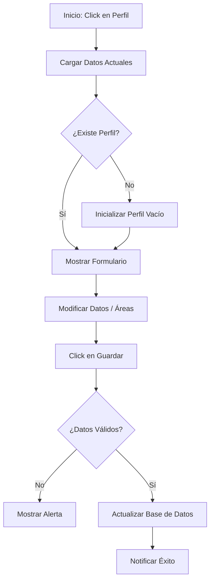
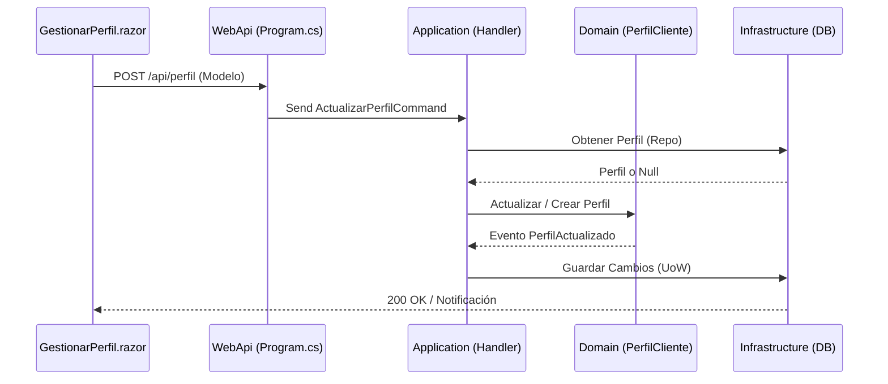

# Caso de Uso: Gestionar Perfil de Cliente (Preferencias Académicas)

## 👥 Perspectiva Funcional
### Objetivo
Permitir que el estudiante (cliente) personalice su perfil académico, estableciendo su nivel de estudios, áreas de interés y urgencia de entregas para recibir un servicio más personalizado y eficiente.

### Actores
- **Estudiante**: Usuario autenticado que desea gestionar su información.

### Guía de Uso
1. Ingrese a la plataforma y haga clic en su **Perfil** (ícono de usuario en el menú inferior en móvil o tarjeta lateral en web).
2. Se presentará el formulario "Perfil Académico".
3. Seleccione su **Nivel Académico** actual (ej: Pregrado, Maestría).
4. Indique su **Urgencia de Entregas** habitual.
5. Ingrese un **Teléfono** de contacto opcional.
6. En la sección **Áreas de Interés**, escriba temas de su interés (ej: Inteligencia Artificial, Derecho Civil) y presione el botón "+" o la tecla Enter.
7. Puede eliminar áreas de interés haciendo clic en la "X" del distintivo (badge) correspondiente.
8. Presione **Guardar Cambios** para persistir la información.

### Reglas de Negocio
- El sistema crea automáticamente un perfil básico si el estudiante nunca ha ingresado a esta sección.
- No se permiten áreas de interés vacías.
- Las áreas de interés son únicas (no se permiten duplicados por usuario).

## 💻 Perspectiva Técnica
### Mapa de Componentes
| Capa | Proyecto | Archivo | Responsabilidad |
| :--- | :--- | :--- | :--- |
| Presentación (RCL) | `Shared.UI` | `GestionarPerfil.razor` | Componente de UI compartido con Radzen. |
| Presentación (Web) | `Web` | `PerfilService.cs` | Llamadas API usando cookies/JWT. |
| Presentación (Maui) | `Maui` | `PerfilService.cs` | Llamadas API usando Preferences/JWT. |
| WebApi | `WebApi` | `Program.cs` | Definición de endpoints Minimal API bajo `/api/perfil`. |
| Aplicación | `Application` | `ActualizarPerfilHandler.cs` | Lógica de coordinación y persistencia. |
| Dominio | `Domain` | `PerfilCliente.cs` | Raíz de Agregado con lógica de negocio. |
| Infraestructura | `Infrastructure` | `PerfilClienteRepository.cs` | Persistencia en SQL Server mediante EF Core. |

### Contrato de Datos
El comando `ActualizarPerfilCommand` recibe:
- `UsuarioId` (Guid): Identificado automáticamente desde el token JWT.
- `NivelAcademico` (int): Valor del enumerado.
- `UrgenciaEntrega` (int): Valor del enumerado.
- `Telefono` (string?): Formato texto.
- `AreasInteres` (List<string>): Colección de temas.

### Lógica de Dominio
La lógica reside en la entidad `PerfilCliente`, que encapsula el comportamiento de la colección `_areasInteres` y garantiza que el objeto de valor `Telefono` sea válido.

