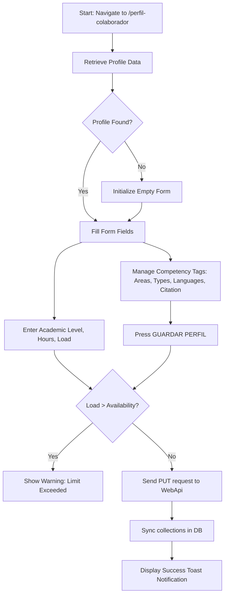
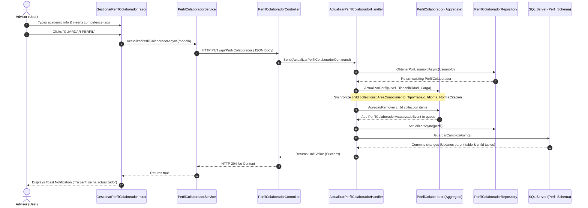

# Use Case: Gestionar Perfil Profesional de Colaborador (Habilidades/Disponibilidad)

## 👥 Functional Perspective

### Purpose
To enable Collaborators (academic advisors/assessors) to manage their professional profile inside the GrupoXpert platform. This profile is distinct from standard Student (Client) profiles and is strictly designed to collect academic expertise, weekly hour availability, work-type mastery, and languages. This data feeds into matching and assignment algorithms to pair collaborators with matching academic project opportunities.

### Actors
*   **Collaborator / Advisor (Asesor / Colaborador)**: Allowed to query and update their professional profile details.
*   **Administrator**: Can audit and validate the professional profile (and quality rating) under the validation flow.

### Usage Guide
1.  **Access**: The Advisor signs in and navigates to the `/perfil-colaborador` page.
2.  **Academic Profile Form**: The system displays a premium card interface with structured information folders:
    *   *Academic Degree (Nivel Académico)*: Dropdown menu including options like Pregrado/Licenciatura, Maestría, Doctorado, etc.
    *   *Weekly Availability (Disponibilidad Horaria)*: Form input to specify total weekly working hours.
    *   *Ideal Academic Load (Carga Académica)*: Number of parallel jobs or deliverables target per week.
3.  **Core Competencies (Badges/Tags)**:
    *   To add a competence (Knowledge Area, Work Type, Language, or Citation Standard), the user types into the textbox (e.g., "Derecho", "Tesis", "Portugués", "APA 7") and clicks the "+" button or presses `Enter`.
    *   The system dynamically lists the added competences as colored tags with a clear "close" button.
    *   The user clicks a tag's "close" button to instantly remove that item.
4.  **Submission**: Clicking **GUARDAR PERFIL** triggers the backend synchronization and displays a success notification.
5.  **Validation Status Indicator**:
    *   If the profile has been validated by an Admin, a green "Verified" badge is displayed.
    *   If pending, a warning orange badge shows "Pendiente de Verificación".

### Business & Validation Rules
*   **Carga Ideal Limit**: The ideal academic load cannot exceed the total weekly availability hours declared.
*   **Scale of Quality Rating**: The quality assessment score (updated exclusively by administrators) must reside within the strict range of `0.0` to `5.0`.
*   **No Duplication**: The list of competencies (e.g., Knowledge Areas, Languages) cannot contain duplicate items (case-insensitive).
*   **Immutability of Status**: Advisors cannot self-approve or self-validate their profiles. Admin approval is required.

### Functional Flowchart

---

## 💻 Technical Perspective

### Component Map

| Layer | Project | File / Path | Responsibility |
| :--- | :--- | :--- | :--- |
| **Presentation (Web)** | `GrupoXpert.Web` | `Components/Pages/PerfilColaborador.razor` | Route handler for `/perfil-colaborador`, restricted via Authorize attribute to roles `Colaborador,Asesor`. |
| **Presentation (RCL)** | `GrupoXpert.Shared.UI` | `Componentes/Perfil/GestionarPerfilColaborador.razor` | Premium Blazor UI component using Radzen forms, color-coded badges, and event handles for dynamic lists. |
| **Presentation (Model)**| `GrupoXpert.Shared.UI` | `Modelos/Perfil/PerfilColaboradorModelo.cs` | Transfer model for front-to-back serialization. Properties match the Spanish backend contracts perfectly. |
| **Presentation (Service)**| `GrupoXpert.Web` | `Services/PerfilColaboradorService.cs` | REST client that injects bearer authentication token and calls the WebApi endpoint. |
| **Presentation (DI)**| `GrupoXpert.Web` | `Program.cs` | Registers `IPerfilColaboradorService` implementation in the DI container. |
| **Presentation (API)** | `GrupoXpert.WebApi` | `Controllers/PerfilColaboradorController.cs` | Exposes REST endpoints: GET `/{usuarioId}`, PUT `/`, and POST `/validar` (admin-locked). |
| **Application (Query)**| `GrupoXpert.Application`| `Perfil/Queries/ObtenerPerfilColaboradorQuery.cs` | MediatR query to fetch the collaborator's profile by `UsuarioId`. |
| **Application (Query)**| `GrupoXpert.Application`| `Perfil/Queries/ObtenerPerfilColaboradorHandler.cs`| MediatR handler calling the repository and mapping entity to DTO. |
| **Application (Command)**| `GrupoXpert.Application`| `Perfil/Commands/ActualizarPerfilColaboradorCommand.cs`| MediatR command holding input values and child collections. |
| **Application (Command)**| `GrupoXpert.Application`| `Perfil/Commands/ActualizarPerfilColaboradorHandler.cs`| Core logic. Synchronizes owned child collections (additions/deletions) and saves to database. |
| **Application (Command)**| `GrupoXpert.Application`| `Perfil/Commands/ValidarPerfilProfesionalCommand.cs`| MediatR command for admin validation. Named to avoid overlap with Identity validation. |
| **Domain (Aggregate)**| `GrupoXpert.Domain` | `Perfil/PerfilColaborador.cs` | Aggregate Root. Enforces business invariants, registers domain events. |
| **Domain (VOs)** | `GrupoXpert.Domain` | `Perfil/AreaConocimiento.cs`   `Perfil/TipoTrabajo.cs`   `Perfil/Idioma.cs`   `Perfil/NormaCitacion.cs` | Immutable owned entities supporting child collection storage in separate physical tables. |
| **Domain (Events)** | `GrupoXpert.Domain` | `Perfil/Events/PerfilColaboradorActualizadoEvent.cs`   `Perfil/Events/PerfilColaboradorValidadoEvent.cs` | Domain events implementing `IDomainEvent.FechaOcurrencia`. |
| **Domain (Repository)**| `GrupoXpert.Domain` | `Perfil/IPerfilColaboradorRepository.cs` | Repository contract for Domain persistence. |
| **Infrastructure (Repo)**| `GrupoXpert.Infrastructure`| `Repositories/PerfilColaboradorRepository.cs` | EF Core database access implementation. |
| **Infrastructure (Map)** | `GrupoXpert.Infrastructure`| `Persistence/Configurations/PerfilColaboradorConfiguracion.cs`| Explicit Fluent API configuration mapping owned child entities and generating auto-increment identifiers. |

### Data Contract

#### `ActualizarPerfilColaboradorCommand`
*   `Guid UsuarioId`: Unique identifier of the authenticated advisor.
*   `int NivelAcademico`: Casted to the domain `NivelAcademico` enum.
*   `int DisponibilidadHorasSemana`: Weekly availability.
*   `int CargaAcademicaIdeal`: Target weekly load.
*   `List<string> AreasConocimiento`: Collection of knowledge areas.
*   `List<string> TiposTrabajo`: Collection of mastered job types.
*   `List<string> Idiomas`: Mastered languages.
*   `List<string> NormasCitacion`: Citation styles handled.

### Sequence Diagram

