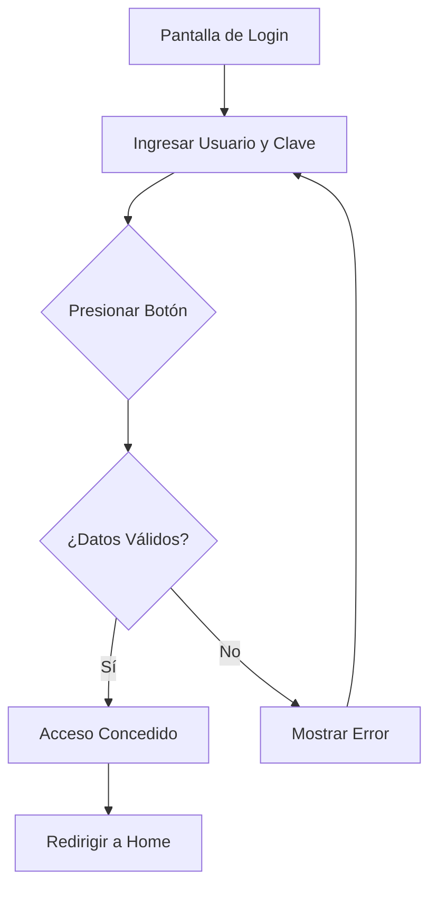
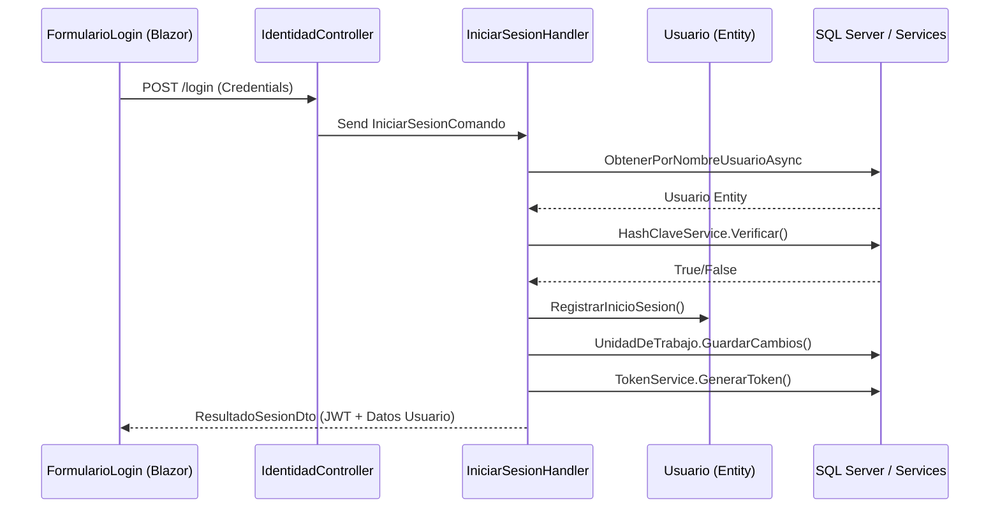

# Caso de Uso: Inicio de Sesión (Login)

## 👥 Perspectiva Funcional (Manual de Usuario)

### Objetivo
Permitir que un usuario acceda de forma segura a la aplicación GrupoXpert validando su identidad mediante un nombre de usuario y una contraseña secreta.

### Actores
- **Usuario**: Cualquier persona registrada con una cuenta activa en el sistema.

### Guía de Uso
1. **Acceso**: Al abrir la aplicación, el sistema presentará la pantalla de bienvenida con el formulario de acceso.
2. **Identificación**: Ingrese su **Nombre de Usuario** asignado.
3. **Seguridad**: Ingrese su **Contraseña**. Por seguridad, los caracteres se mostrarán ocultos.
4. **Validación**: Presione el botón **"Iniciar Sesión"**.
5. **Resultado**:
   - Si los datos son correctos, será redirigido al panel principal de la aplicación.
   - Si los datos son incorrectos, el sistema mostrará un mensaje de alerta: *"Credenciales inválidas"*.

### Reglas de Negocio
- El nombre de usuario es sensible a mayúsculas/minúsculas (según configuración).
- La contraseña se valida contra un hash seguro; el sistema nunca conoce la clave real.
- Cada inicio de sesión exitoso queda registrado internamente con la fecha y hora del acceso.

---

## 💻 Perspectiva Técnica (Guía del Desarrollador)

### Mapa de Componentes (Clean Architecture)

| Capa | Proyecto | Archivo | Responsabilidad |
| :--- | :--- | :--- | :--- |
| **UI** | `Shared.UI` | `FormularioLogin.razor` | Captura de datos y feedback visual (Radzen). |
| **API** | `WebApi` | `IdentidadController.cs` | Endpoint `POST /api/identidad/login`. |
| **Aplicación** | `Application` | `IniciarSesionComando.cs` | DTO que transporta las credenciales. |
| **Aplicación** | `Application` | `IniciarSesionHandler.cs` | Orquestador: valida repo, verifica hash y genera token. |
| **Dominio** | `Domain` | `Usuario.cs` | Entidad raíz. Contiene `RegistrarInicioSesion()`. |
| **Dominio** | `Domain` | `ClaveAcceso.cs` | Value Object que gestiona la seguridad de la clave. |
| **Infraestructura**| `Infrastructure`| `UsuarioRepository.cs` | Consulta a SQL Server por nombre de usuario. |
| **Infraestructura**| `Infrastructure`| `HashClaveService.cs` | Lógica criptográfica para verificar contraseñas. |

### Flujo de Datos y Lógica
1. El `FormularioLogin` envía un `IniciarSesionComando`.
2. El `Handler` recupera al `Usuario` mediante `IUsuarioRepository`.
3. Se delega la verificación al `IHashClaveService`.
4. Si es exitoso, se llama a `usuario.RegistrarInicioSesion()` para actualizar el estado del dominio.
5. Se utiliza `ITokenService` para emitir el JWT (JSON Web Token) de sesión.

### Diagrama de Secuencia Técnico

### Persistencia
- **Tabla**: `Usuarios`
- **Campos Clave**: `NombreUsuario`, `HashClave`, `UltimoAcceso`.

<!-- Generated by docs skill v2.0.0 -->
