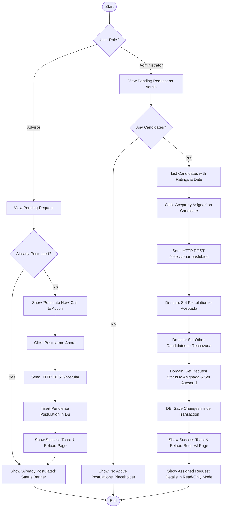
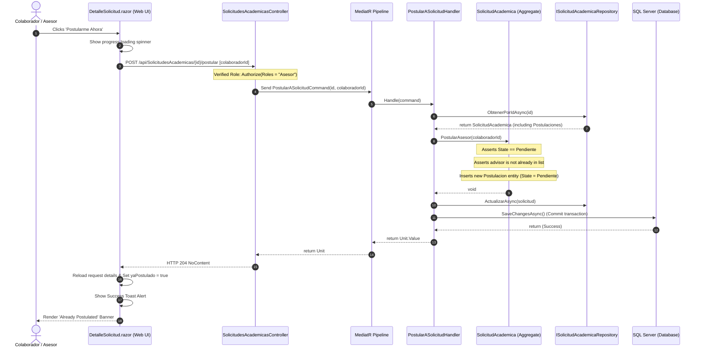
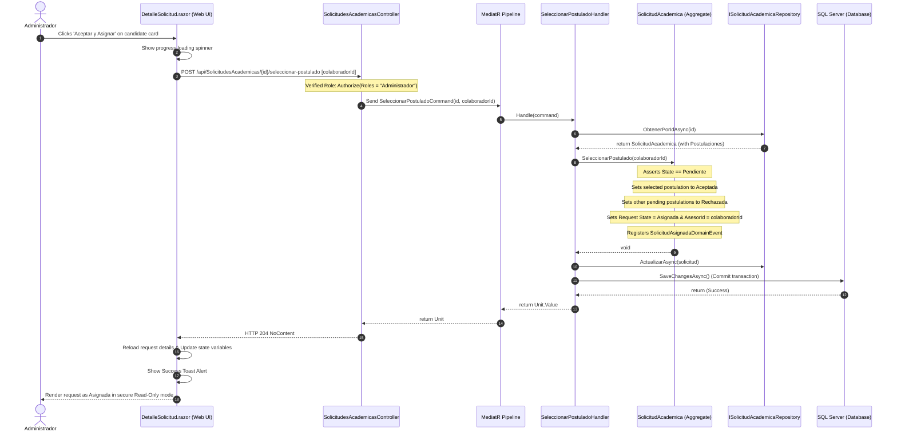

# Use Case: Postular a Asignación de Proyecto (Postulate to Project Assignment)

## 👥 Functional Perspective (User Manual)

### Goal
This usecase allows approved academic **Colaboradores / Asesores** (Advisors) to review open requests in the **Pendiente** (Pending) status and actively postulate themselves to be chosen for the assignment. Additionally, it enables system **Administrators** to review the list of interested advisors directly on the request's detail page and select the best candidate. When a candidate is selected, they are assigned to the request, and the request status shifts to **Asignada** (Assigned).

### Actors
* **Colaborador / Asesor** (Advisor): Can view open pending requests and submit a postulation.
* **Administrador** (Administrator): Can view the list of candidates, see their ratings, and accept a postulation to assign them.

---

### Usage Guide

#### For Advisors (Submitting a Postulation)
1. Navigate to the **Home Dashboard**.
2. Select any request showing a status of **Pendiente** (Pending).
3. If you have not yet postulated, a premium interactive card titled **"¿Te interesa este proyecto académico?"** (Are you interested in this academic project?) will be displayed in the lower section of the page.
4. Review the request's details, requirements, formatting guidelines, and delivery date.
5. Click the **"Postularme Ahora"** (Postulate Now) button.
6. A success toast notification will appear in the top-right corner.
7. The page will automatically reload, replacing the action card with a success banner stating **"¡Ya te has postulado a este proyecto!"** (You have already postulated to this project!), and setting the postulation status to **"Postulación en Revisión"** (Postulation under Review).

#### For Administrators (Selecting a Postulated Advisor)
1. Go to the request details page for a **Pendiente** (Pending) request.
2. In the lower section, a dedicated panel titled **"Asesores Postulados"** (Postulated Advisors) will display the total number of applications received.
3. If no advisors have postulated, a clear, dashed placeholder will indicate **"Sin postulaciones activas"** (No active postulations).
4. If there are active candidates, they will be listed in a sleek list layout showing:
   * The advisor's name initials and full name.
   * The precise date and time of their postulation.
   * A premium **5-star visual rating** displaying their quality average (e.g., ⭐⭐⭐⭐⭐ `4.8`).
5. Review the candidates' qualifications and click the green **"Aceptar y Asignar"** (Accept and Assign) button next to the desired candidate.
6. A success toast notification will appear confirming the assignment.
7. The request details page will immediately reload, transitioning the request status to **Asignada** (Assigned), showing the chosen advisor's name as the assigned professional, and disabling further postulations or assignments.

---

### Business Rules
* **Status Invariant:** Postulations and candidate selections can only occur when the academic request is strictly in the `Pendiente` (Pending, value `1`) state.
* **Advisor Approved State:** Only advisors with an approved and active profile (`PerfilColaborador`) can submit postulations.
* **Uniqueness Invariant:** An advisor can only postulate once to a specific academic request. Subsequent postulation attempts are blocked both on the UI and in the domain layer.
* **Acceptance and Rejection Cascade:** Selecting and accepting a candidate automatically:
   * Sets the selected postulation's status to `Aceptada` (Accepted, value `2`).
   * Transition-rejects all other pending postulations for that request to `Rechazada` (Rejected, value `3`).
   * Updates the parent request's state to `Asignada` (Assigned, value `5`) and sets the `AsesorId` foreign key to the chosen advisor.
   * Fires the `SolicitudAsignadaDomainEvent` domain event.

---

### Process Flowchart



---

## 💻 Technical Perspective (Developer Guide)

### File Map

| Layer | Project | File / Path | Responsibility |
| :--- | :--- | :--- | :--- |
| **Presentation** | `GrupoXpert.Web` | [`DetalleSolicitud.razor`](file:///e:/Documentos/Proyectos/GrupoXpert/Src/GrupoXpert/GrupoXpert.Web/Components/Pages/DetalleSolicitud.razor) | Blazor page rendering advisor action banners, showing the advisor's postulation status, listing candidate cards for admins (with star ratings), and invoking service calls. |
| **Presentation** | `GrupoXpert.Maui` | [`DetalleSolicitud.razor`](file:///e:/Documentos/Proyectos/GrupoXpert/Src/GrupoXpert/GrupoXpert.Maui/Components/Pages/DetalleSolicitud.razor) | Blazor Hybrid Mobile page handling responsive rendering of details and notch-friendly layouts. |
| **Shared UI** | `GrupoXpert.Shared.UI` | [`ISolicitudAcademicaService.cs`](file:///e:/Documentos/Proyectos/GrupoXpert/Src/GrupoXpert/GrupoXpert.Shared.UI/Abstracciones/ISolicitudAcademicaService.cs) | Interface declaring API contracts: `PostularASolicitudAsync` and `SeleccionarPostuladoAsync`. |
| **Shared UI** | `GrupoXpert.Shared.UI` | [`SolicitudAcademicaDto.cs`](file:///e:/Documentos/Proyectos/GrupoXpert/Src/GrupoXpert/GrupoXpert.Shared.UI/Modelos/Academia/SolicitudAcademicaDto.cs) | Data Transfer Object containing a list of `Postulaciones` to safely display candidates on the frontend. |
| **Application** | `GrupoXpert.Application` | [`PostularASolicitudCommand.cs`](file:///e:/Documentos/Proyectos/GrupoXpert/Src/GrupoXpert/GrupoXpert.Application/Academia/Commands/PostularASolicitudCommand.cs) | MediatR command carrying request ID and candidate ID. |
| **Application** | `GrupoXpert.Application` | [`PostularASolicitudHandler.cs`](file:///e:/Documentos/Proyectos/GrupoXpert/Src/GrupoXpert/GrupoXpert.Application/Academia/Commands/PostularASolicitudHandler.cs) | Fetches the request aggregate, executes `solicitud.PostularAsesor(colaboradorId)`, and saves changes. |
| **Application** | `GrupoXpert.Application` | [`SeleccionarPostuladoCommand.cs`](file:///e:/Documentos/Proyectos/GrupoXpert/Src/GrupoXpert/GrupoXpert.Application/Academia/Commands/SeleccionarPostuladoCommand.cs) | MediatR command carrying request ID and selected candidate ID. |
| **Application** | `GrupoXpert.Application` | [`SeleccionarPostuladoHandler.cs`](file:///e:/Documentos/Proyectos/GrupoXpert/Src/GrupoXpert/GrupoXpert.Application/Academia/Commands/SeleccionarPostuladoHandler.cs) | Fetches the request, executes `solicitud.SeleccionarPostulado(colaboradorId)`, and updates the database state. |
| **Application** | `GrupoXpert.Application` | [`ObtenerSolicitudPorIdHandler.cs`](file:///e:/Documentos/Proyectos/GrupoXpert/Src/GrupoXpert/GrupoXpert.Application/Academia/Queries/ObtenerSolicitudPorIdHandler.cs) | Resolves advisor details (full name and quality rating) dynamically to hydrate the `Postulaciones` DTO list returned to the frontend. |
| **Domain** | `GrupoXpert.Domain` | [`SolicitudAcademica.cs`](file:///e:/Documentos/Proyectos/GrupoXpert/Src/GrupoXpert/GrupoXpert.Domain/Academia/SolicitudAcademica.cs) | Aggregate root encapsulating business validation rules for `PostularAsesor()` and `SeleccionarPostulado()`. |
| **Domain** | `GrupoXpert.Domain` | [`Postulacion.cs`](file:///e:/Documentos/Proyectos/GrupoXpert/Src/GrupoXpert/GrupoXpert.Domain/Academia/Postulacion.cs) | Entity representing a single postulation record, holding dates, states, and transition rules. |
| **Domain** | `GrupoXpert.Domain` | [`EstadoPostulacion.cs`](file:///e:/Documentos/Proyectos/GrupoXpert/Src/GrupoXpert/GrupoXpert.Domain/Academia/EstadoPostulacion.cs) | Enum defining the states of a postulation (`Pendiente = 1`, `Aceptada = 2`, `Rechazada = 3`). |
| **Infrastructure** | `GrupoXpert.Infrastructure` | [`PostulacionConfiguracion.cs`](file:///e:/Documentos/Proyectos/GrupoXpert/Src/GrupoXpert/GrupoXpert.Infrastructure/Persistence/Configurations/PostulacionConfiguracion.cs) | EF Core configuration establishing database table name mapping, foreign key constraints, and enum conversions. |
| **WebApi** | `GrupoXpert.WebApi` | [`SolicitudesAcademicasController.cs`](file:///e:/Documentos/Proyectos/GrupoXpert/Src/GrupoXpert/GrupoXpert.WebApi/Controllers/SolicitudesAcademicasController.cs) | Exposes endpoints `POST api/SolicitudesAcademicas/{id}/postular` and `POST api/SolicitudesAcademicas/{id}/seleccionar-postulado` protected with appropriate role filters (`Asesor` and `Administrador`). |
| **Database** | MS SQL Server | `[Academia].[Postulaciones]` | Physical table storing the postulation records with an automatic cascading FK constraint referencing parent requests and advisor profiles. |

---

### Data Contracts

#### PostularASolicitudCommand
```csharp
namespace GrupoXpert.Application.Academia.Commands;

public sealed record PostularASolicitudCommand(
    Guid SolicitudId, 
    Guid ColaboradorId
) : IRequest<Unit>;
```

#### SeleccionarPostuladoCommand
```csharp
namespace GrupoXpert.Application.Academia.Commands;

public sealed record SeleccionarPostuladoCommand(
    Guid SolicitudId, 
    Guid ColaboradorId
) : IRequest<Unit>;
```

---

### Domain Logic Invariants

Inside the `SolicitudAcademica` Aggregate Root:

```csharp
public void PostularAsesor(Guid colaboradorId)
{
    // The request must be strictly in the Pending state
    if (Estado != EstadoSolicitud.Pendiente)
    {
        throw new Exceptions.ExcepcionDominio("Solo se puede postular a solicitudes que estén pendientes.");
    }

    // The advisor must not have already postulated to this request
    if (_postulaciones.Any(p => p.ColaboradorId == colaboradorId))
    {
        throw new Exceptions.ExcepcionDominio("El colaborador ya se encuentra postulado a esta solicitud.");
    }

    _postulaciones.Add(new Postulacion(Id, colaboradorId));
}

public void SeleccionarPostulado(Guid colaboradorId)
{
    // The request must be strictly in the Pending state
    if (Estado != EstadoSolicitud.Pendiente)
    {
        throw new Exceptions.ExcepcionDominio("Solo se puede seleccionar un postulado para solicitudes pendientes.");
    }

    // The selected candidate must exist in the postulation list
    var postulacion = _postulaciones.FirstOrDefault(p => p.ColaboradorId == colaboradorId);
    if (postulacion == null)
    {
        throw new Exceptions.ExcepcionDominio("El colaborador no se ha postulado a esta solicitud.");
    }

    // Accept the chosen candidate
    postulacion.Aceptar();

    // Reject all other pending candidates
    foreach (var p in _postulaciones.Where(x => x.ColaboradorId != colaboradorId && x.Estado == EstadoPostulacion.Pendiente))
    {
        p.Rechazar();
    }

    // Assign the request to the advisor
    AsignarAsesor(colaboradorId);
}
```

---

### Data Flow & Sequence Diagram

The following sequence diagram displays the step-by-step processing of a postulation and its subsequent selection and assignment:

#### 1. Advisor Postulation Flow



#### 2. Administrator Selection & Assignment Flow


