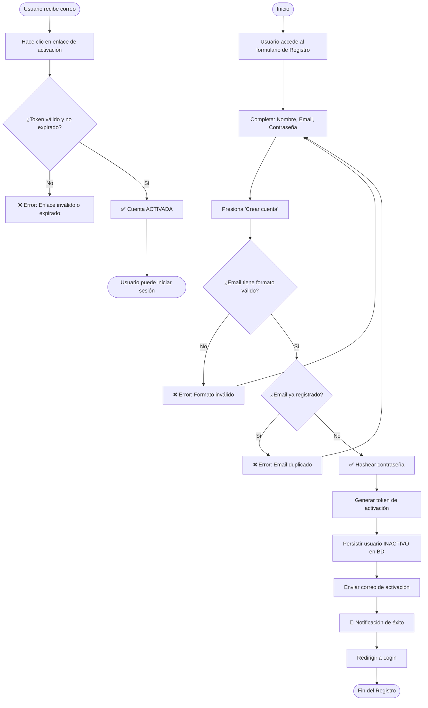
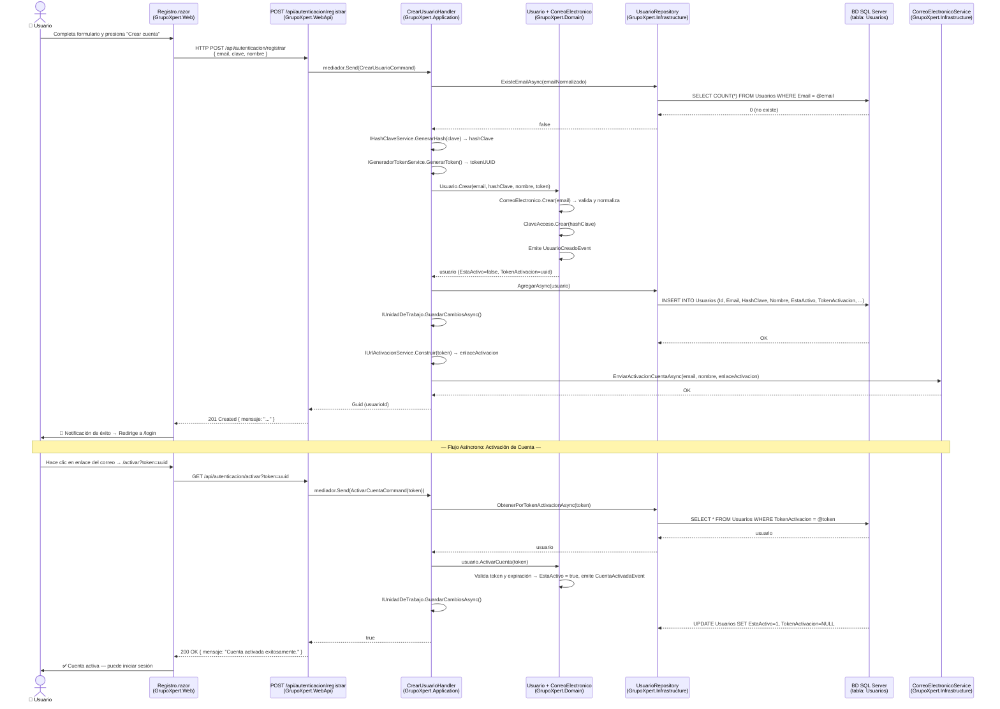

# Caso de Uso: Registrar Usuario

> **Módulo:** Identidad | **Versión:** 1.0 | **Autor:** GrupoXpert Dev Team  
> **Última actualización:** 2026-04-28

---

## 👥 Perspectiva Funcional (Manual de Usuario)

### Objetivo

Permitir que cualquier persona interesada en el sistema se registre de forma autónoma proporcionando su correo electrónico, nombre y contraseña. Al completar el registro, el sistema crea la cuenta en estado **inactivo** y envía automáticamente un correo de activación al email indicado. El usuario no podrá iniciar sesión hasta confirmar su cuenta desde ese enlace.

---

### Actores

| Actor | Descripción |
| :--- | :--- |
| **Visitante Anónimo** | Cualquier persona sin cuenta en el sistema. Es el único actor que ejecuta este flujo. |

---

### Guía de Uso

1. El usuario ingresa a la dirección de la aplicación en su navegador y hace clic en el enlace **"¿No tienes cuenta? Regístrate"** en la pantalla de inicio de sesión.
2. El sistema muestra el formulario de registro con los siguientes campos:
   - **Nombre completo** *(obligatorio)*
   - **Correo electrónico** *(obligatorio, será el identificador de login)*
   - **Contraseña** *(obligatoria)*
   - **Confirmar contraseña** *(obligatoria)*
3. El usuario completa todos los campos y presiona el botón **"Crear cuenta"**.
4. Mientras el sistema procesa la solicitud, el botón muestra un indicador de carga y queda deshabilitado para evitar envíos duplicados.
5. El sistema evalúa los datos ingresados:
   - **Si hay errores de validación**: muestra una notificación de error en pantalla indicando el problema (ej: "El correo ya está registrado").
   - **Si el registro es exitoso**: muestra una notificación de éxito con el mensaje *"Usuario creado. Por favor revisa tu correo para activar la cuenta."* y redirige automáticamente a la pantalla de inicio de sesión luego de 2 segundos.
6. El usuario recibe en su bandeja de entrada un correo con un **enlace de activación** válido por **24 horas**.
7. Al hacer clic en el enlace del correo, el sistema activa la cuenta y el usuario puede iniciar sesión normalmente.

---

### Reglas de Negocio

| # | Regla | Consecuencia si se viola |
| :--- | :--- | :--- |
| **RN-01** | El correo electrónico debe tener formato válido (RFC 5322, máx. 254 caracteres). | El sistema rechaza el registro con un mensaje de error de formato. |
| **RN-02** | El correo electrónico debe ser único en el sistema (no puede existir otro usuario con el mismo correo). | El sistema rechaza el registro indicando que el correo ya está registrado. |
| **RN-03** | El nombre es obligatorio y no puede superar los 150 caracteres. | El sistema rechaza el registro con un mensaje de validación. |
| **RN-04** | La cuenta se crea **inactiva** hasta que el usuario confirme el correo. | El usuario no puede iniciar sesión con una cuenta inactiva. |
| **RN-05** | El enlace de activación expira en **24 horas** desde el momento del registro. | El usuario deberá solicitar un nuevo enlace de activación si supera ese plazo. |
| **RN-06** | La contraseña nunca se almacena en texto plano; siempre se guarda como un **hash seguro** (bcrypt). | Garantía de seguridad: incluso si la base de datos es comprometida, la contraseña no es recuperable. |

---

### Diagrama de Flujo



---

## 💻 Perspectiva Técnica (Guía del Desarrollador)

### Mapa de Componentes

| Capa | Proyecto | Archivo | Responsabilidad |
| :--- | :--- | :--- | :--- |
| **Presentación Web** | `GrupoXpert.Web` | `Registro.razor` | Página de registro. Inyecta `IAutenticacionService` y delega al componente `FormularioRegistro`. |
| **Componente UI Compartido** | `GrupoXpert.Shared.UI` | `FormularioRegistro.razor` | Componente Radzen con el formulario. Captura datos y emite el evento `AlRegistrar`. |
| **Servicio Frontend** | `GrupoXpert.Shared.UI` | `IAutenticacionService.cs` | Contrato del servicio HTTP del frontend. Método: `RegistrarAsync`. |
| **Endpoint API** | `GrupoXpert.WebApi` | `Program.cs` | Minimal API: `POST /api/autenticacion/registrar`. Recibe el `CrearUsuarioCommand` y lo despacha con MediatR. |
| **Comando CQRS** | `GrupoXpert.Application` | `CrearUsuarioCommand.cs` | Registro del intent. Define los datos de entrada para MediatR. |
| **Manejador** | `GrupoXpert.Application` | `CrearUsuarioHandler.cs` | Orquesta toda la lógica: unicidad, hashing, token, persistencia y correo. |
| **Agregado de Dominio** | `GrupoXpert.Domain` | `Usuario.cs` | Raíz de Agregado. Método `Crear(...)` valida invariantes y emite `UsuarioCreadoEvent`. |
| **Objeto de Valor** | `GrupoXpert.Domain` | `CorreoElectronico.cs` | Valida formato RFC 5322 y normaliza a minúsculas. |
| **Objeto de Valor** | `GrupoXpert.Domain` | `ClaveAcceso.cs` | Encapsula el hash de la clave. |
| **Evento de Dominio** | `GrupoXpert.Domain` | `UsuarioCreadoEvent.cs` | Evento emitido al crear el usuario (implementa `IDomainEvent`). |
| **Repositorio** | `GrupoXpert.Infrastructure` | `UsuarioRepository.cs` | Implementación EF Core de `IUsuarioRepository`. Método: `AgregarAsync`. |
| **Configuración BD** | `GrupoXpert.Infrastructure` | `UsuarioConfiguration.cs` | Mapeo EF Core de `Usuario` a la tabla `Usuarios`. Owned Entities para VOs. |
| **Servicio Hash** | `GrupoXpert.Infrastructure` | `HashClaveService.cs` | Implementación de `IHashClaveService`. Genera el hash bcrypt de la clave. |
| **Servicio Token** | `GrupoXpert.Infrastructure` | `GeneradorTokenService.cs` | Genera el UUID v4 usado como token de activación. |
| **Servicio URL** | `GrupoXpert.Infrastructure` | `UrlActivacionService.cs` | Construye la URL completa del enlace de activación. |
| **Servicio Correo** | `GrupoXpert.Infrastructure` | `CorreoElectronicoService.cs` | Envía el email de activación al usuario registrado. |
| **Pruebas Dominio** | `GrupoXpert.UnitTests` | `UsuarioTests.cs` | 17 pruebas de invariantes del Agregado `Usuario`. Sin mocks. |
| **Pruebas Dominio** | `GrupoXpert.UnitTests` | `CorreoElectronicoTests.cs` | 13 pruebas de formato y semántica del VO `CorreoElectronico`. Sin mocks. |
| **Pruebas Aplicación** | `GrupoXpert.UnitTests` | `CrearUsuarioHandlerTests.cs` | 13 pruebas del Handler con NSubstitute para todas las dependencias. |

---

### Contrato de Datos

#### Entrada — `CrearUsuarioCommand`

```csharp
public sealed record CrearUsuarioCommand(
    string  Email,          // Correo electrónico único (se normaliza a minúsculas)
    string  Clave,          // Contraseña en texto plano (se hashea en el Handler)
    string  Nombre,         // Nombre completo del usuario (máx. 150 caracteres)
    string? Imagen = null   // URL/ruta de imagen de perfil (opcional)
) : IRequest<Guid>;         // Retorna el Guid del usuario recién creado
```

#### Retorno

| Escenario | Tipo | Descripción |
| :--- | :--- | :--- |
| **Éxito** | `Guid` | ID único del usuario recién creado. Retornado por el Handler. |
| **Email duplicado** | `ExcepcionDominio` | `"El correo electrónico '{email}' ya está registrado."` |
| **Email inválido** | `ExcepcionDominio` | `"El formato del correo electrónico '{email}' no es válido."` |
| **Nombre vacío** | `ExcepcionDominio` | `"El nombre del usuario es obligatorio."` |
| **Nombre muy largo** | `ExcepcionDominio` | `"El nombre no puede exceder 150 caracteres."` |

#### Endpoint REST

```
POST /api/autenticacion/registrar
Content-Type: application/json

{
  "email":  "nuevo@grupoxpert.com",
  "clave":  "MiClave.Segura.2026!",
  "nombre": "Germán Álvarez",
  "imagen": null
}
```

**Respuesta exitosa (`201 Created`):**
```json
{
  "mensaje": "Usuario registrado exitosamente. Por favor verifica tu correo para activar la cuenta."
}
```

**Respuesta de error (`400 Bad Request`):**
```json
{
  "mensaje": "El correo electrónico 'nuevo@grupoxpert.com' ya está registrado."
}
```

---

### Lógica de Dominio

Toda la lógica de negocio reside en la capa de **Dominio** y es invocada por el **Handler**:

| Clase/VO | Método | Lógica |
| :--- | :--- | :--- |
| `CorreoElectronico` | `Crear(string email)` | Valida formato RFC 5322, longitud ≤ 254, normaliza a minúsculas. Lanza `ExcepcionDominio` si falla. |
| `ClaveAcceso` | `Crear(string hashClave)` | Encapsula el hash; no permite valores nulos o vacíos. |
| `Usuario` | `Crear(email, hashClave, nombre, token, imagen?)` | Factory method. Valida nombre, crea VOs, inicia cuenta como inactiva, establece expiración del token a +24h y emite `UsuarioCreadoEvent`. |
| `Usuario` | `ActivarCuenta(string token)` | Valida que el token coincida y no haya expirado. Pone `EstaActivo = true`, invalida el token y emite `CuentaActivadaEvent`. |

---

### Diagrama de Secuencia



---

### Esquema de Base de Datos

**Tabla: `Usuarios`** (base de datos: `Grupoxpert`)

| Columna | Tipo SQL | Restricciones | Descripción |
| :--- | :--- | :--- | :--- |
| `Id` | `UNIQUEIDENTIFIER` | `PK`, `NOT NULL` | Identificador único del usuario (GUID generado en dominio) |
| `Email` | `NVARCHAR(254)` | `NOT NULL`, `UNIQUE INDEX` | Correo electrónico normalizado (siempre minúsculas) |
| `Nombre` | `NVARCHAR(150)` | `NOT NULL` | Nombre completo del usuario |
| `HashClave` | `NVARCHAR(500)` | `NOT NULL` | Hash bcrypt de la contraseña (nunca texto plano) |
| `Imagen` | `NVARCHAR(500)` | `NULL` | URL o ruta de imagen de perfil (opcional) |
| `EstaActivo` | `BIT` | `NOT NULL`, `DEFAULT 0` | Indica si la cuenta fue activada por correo |
| `TokenActivacion` | `NVARCHAR(256)` | `NULL` | UUID de activación (se anula tras su uso) |
| `TokenActivacionExpira` | `DATETIMEOFFSET` | `NULL` | Fecha/hora UTC de expiración del token (+24h) |
| `FechaCreacion` | `DATETIMEOFFSET` | `NOT NULL` | Fecha/hora UTC de creación del registro |
| `UltimoInicioSesion` | `DATETIMEOFFSET` | `NULL` | Fecha/hora UTC del último login exitoso |

---

### Cobertura de Pruebas

| Suite | Archivo | Total | Estado |
| :--- | :--- | :--- | :--- |
| Dominio — Agregado | `UsuarioTests.cs` | 17 pruebas | ✅ Verde |
| Dominio — Value Object | `CorreoElectronicoTests.cs` | 13 pruebas | ✅ Verde |
| Aplicación — Handler | `CrearUsuarioHandlerTests.cs` | 13 pruebas | ✅ Verde |
| Aplicación — Handler Login | `IniciarSesionHandlerTests.cs` | 4 pruebas | ✅ Verde |
| **Total** | | **47 pruebas** | **✅ 47/47 Correctas** |

---

> **Nota de Seguridad:** Este caso de uso fue auditado con **Snyk Code Scan** sin vulnerabilidades detectadas en los archivos de prueba y código fuente generado.
