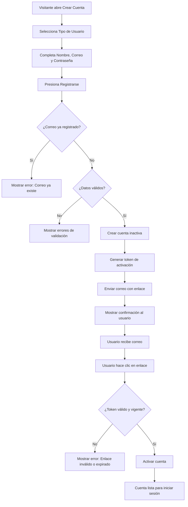
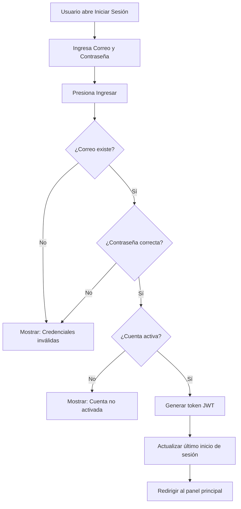
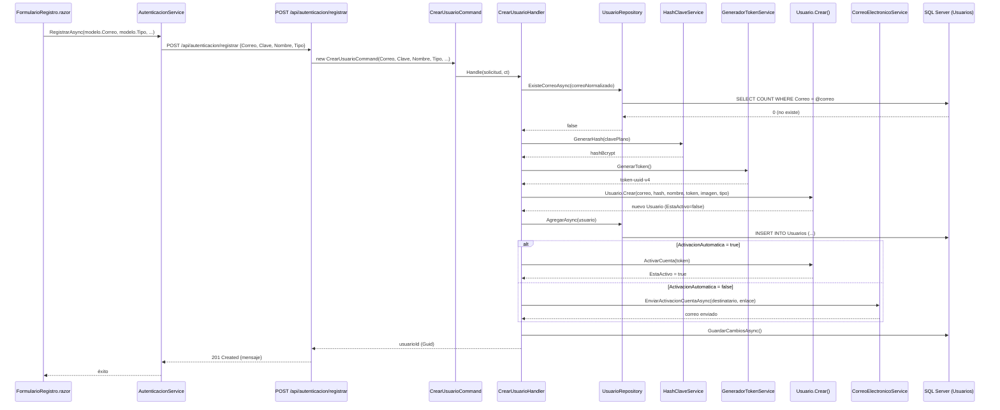
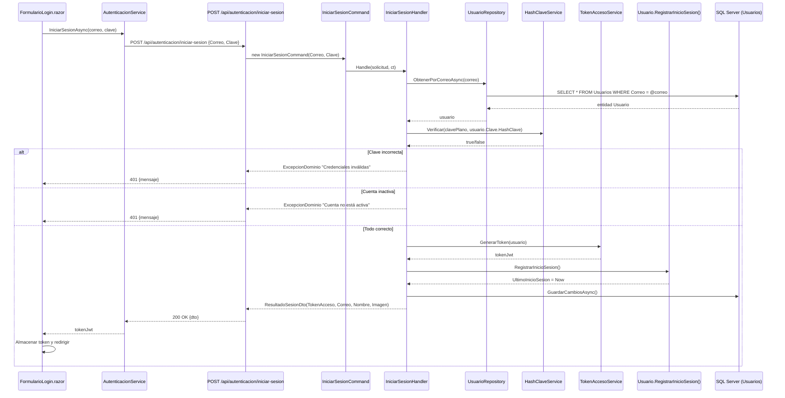

# Caso de Uso: Registro y Autenticación de Usuarios

## 👥 Perspectiva Funcional

### Objetivo
Permitir que una persona se registre en la plataforma GrupoXpert como **Estudiante** o **Asesor**, y posteriormente inicie sesión para acceder a las funcionalidades correspondientes a su rol.

### Actores
| Actor | Descripción |
| :--- | :--- |
| **Visitante** | Persona sin cuenta que desea registrarse en la plataforma. |
| **Estudiante** | Usuario registrado que busca apoyo académico personalizado. |
| **Asesor** | Usuario registrado que ofrece servicios de asesoría académica. |

### Guía de Uso

#### Registro de Nueva Cuenta
1. El visitante accede a la pantalla **"Crear Cuenta"** desde el menú de inicio.
2. El sistema muestra un formulario con los siguientes campos:
   - **Tipo de Usuario**: Lista desplegable con dos opciones:
     - *"Estudiante - Busco apoyo académico personalizado"*
     - *"Asesor - Ofrezco servicios de asesoría académica"*
   - **Nombre Completo**: Texto libre (obligatorio, máximo 150 caracteres).
   - **Correo Electrónico**: Dirección de email válida (obligatorio, único en el sistema).
   - **Contraseña**: Mínimo 6 caracteres (obligatorio).
   - **Confirmar Contraseña**: Debe coincidir con la contraseña ingresada.
3. El usuario selecciona su tipo de cuenta y completa todos los campos.
4. Presiona el botón **"Registrarse"**.
5. El sistema valida:
   - Que el correo no esté previamente registrado.
   - Que las contraseñas coincidan.
   - Que todos los campos obligatorios estén completos.
6. Si la validación es exitosa, el sistema:
   - Crea la cuenta en estado **inactivo**.
   - Envía un correo electrónico con un **enlace de activación** (válido por 24 horas).
   - Muestra un mensaje de confirmación indicando que se envió el correo de verificación.
7. El usuario recibe el correo y hace clic en el enlace de activación.
8. El sistema valida el token y **activa la cuenta**. El usuario ya puede iniciar sesión.

#### Inicio de Sesión
1. El usuario accede a la pantalla **"Iniciar Sesión"**.
2. Ingresa su **correo electrónico** y **contraseña**.
3. Presiona el botón **"Ingresar"**.
4. El sistema valida:
   - Que el correo exista en la base de datos.
   - Que la contraseña sea correcta.
   - Que la cuenta esté **activa**.
5. Si las credenciales son correctas, el sistema genera un **token de acceso (JWT)** y redirige al usuario al panel principal.
6. Si la cuenta está inactiva, el sistema muestra: *"La cuenta no está activa. Por favor verifica tu correo para activarla."*

#### Reglas de Negocio
| # | Regla | Descripción |
| :--- | :--- | :--- |
| RN-01 | **Unicidad de correo** | No se permite registrar dos usuarios con el mismo correo electrónico. |
| RN-02 | **Normalización de correo** | El correo se convierte a minúsculas y se eliminan espacios antes de validar. |
| RN-03 | **Cuenta inactiva por defecto** | Toda cuenta nueva se crea inactiva hasta que el usuario confirma su correo. |
| RN-04 | **Token de activación expirable** | El token de activación vence a las 24 horas de su generación. |
| RN-05 | **Token de un solo uso** | Tras activar la cuenta, el token se invalida permanentemente. |
| RN-06 | **Tipo de usuario obligatorio** | Todo usuario debe ser clasificado como Estudiante o Asesor al momento del registro. |
| RN-07 | **Solo cuentas activas pueden iniciar sesión** | Un usuario inactivo no puede autenticarse, incluso con credenciales correctas. |
| RN-08 | **Solo cuentas activas pueden cambiar clave** | No se permite modificar la contraseña de una cuenta inactiva. |

### Diagrama de Flujo — Registro



### Diagrama de Flujo — Inicio de Sesión



---

## 💻 Perspectiva Técnica

### Mapa de Componentes

| Capa | Proyecto | Archivo | Responsabilidad |
| :--- | :--- | :--- | :--- |
| **Presentación (Web)** | `GrupoXpert.Web` | `Login.razor` | Página de inicio de sesión (Blazor Server/WASM). |
| **Presentación (Web)** | `GrupoXpert.Web` | `Registro.razor` | Página de registro de nuevos usuarios. |
| **Presentación (MAUI)** | `GrupoXpert.Maui` | `Login.razor` | Página de inicio de sesión (MAUI Hybrid). |
| **Presentación (MAUI)** | `GrupoXpert.Maui` | `Registro.razor` | Página de registro (MAUI Hybrid). |
| **UI Compartida** | `GrupoXpert.Shared.UI` | `FormularioLogin.razor` | Componente reutilizable de formulario de login con validación Radzen. |
| **UI Compartida** | `GrupoXpert.Shared.UI` | `FormularioRegistro.razor` | Componente reutilizable de formulario de registro con dropdown `Tipo`. |
| **UI Compartida** | `GrupoXpert.Shared.UI` | `IAutenticacionService.cs` | Interfaz del servicio de autenticación para frontends. |
| **Servicio Web** | `GrupoXpert.Web` | `AutenticacionService.cs` | Implementación HTTP del servicio de autenticación para Web. |
| **API** | `GrupoXpert.WebApi` | `Program.cs` | Endpoints Minimal API: `/registrar`, `/iniciar-sesion`, `/activar`. |
| **Aplicación** | `GrupoXpert.Application` | `CrearUsuarioCommand.cs` | Comando MediatR con campos: `Correo`, `Clave`, `Nombre`, `Tipo`, `Imagen`, `ActivacionAutomatica`. |
| **Aplicación** | `GrupoXpert.Application` | `CrearUsuarioHandler.cs` | Orquesta: unicidad → hash → token → entidad → correo/persistencia. |
| **Aplicación** | `GrupoXpert.Application` | `IniciarSesionCommand.cs` | Comando MediatR con campos: `Correo`, `Clave`. |
| **Aplicación** | `GrupoXpert.Application` | `IniciarSesionHandler.cs` | Orquesta: búsqueda → verificación de clave → validación de estado activo → generación de JWT. |
| **Aplicación** | `GrupoXpert.Application` | `ActivarCuentaCommand.cs` | Comando MediatR para activación por token. |
| **Aplicación** | `GrupoXpert.Application` | `ActivarCuentaHandler.cs` | Busca usuario por token y ejecuta `ActivarCuenta()`. |
| **Aplicación** | `GrupoXpert.Application` | `ResultadoSesionDto.cs` | DTO de respuesta: `TokenAcceso`, `Correo`, `Nombre`, `Imagen`. |
| **Dominio** | `GrupoXpert.Domain` | `Usuario.cs` | **Aggregate Root**. Métodos: `Crear()`, `ActivarCuenta()`, `RegistrarInicioSesion()`, `CambiarClave()`, `ActualizarPerfil()`, `Desactivar()`. |
| **Dominio** | `GrupoXpert.Domain` | `TipoUsuario.cs` | **Enum**: `Estudiante = 1`, `Asesor = 2`. |
| **Dominio** | `GrupoXpert.Domain` | `CorreoElectronico.cs` | **Value Object**. Validación de formato RFC 5322, normalización a minúsculas, límite 254 caracteres. |
| **Dominio** | `GrupoXpert.Domain` | `ClaveAcceso.cs` | **Value Object**. Encapsula el hash de la contraseña. |
| **Dominio** | `GrupoXpert.Domain` | `UsuarioCreadoEvent.cs` | **Domain Event**: se emite al crear un usuario. |
| **Dominio** | `GrupoXpert.Domain` | `CuentaActivadaEvent.cs` | **Domain Event**: se emite al activar una cuenta. |
| **Dominio** | `GrupoXpert.Domain` | `SesionIniciadaEvent.cs` | **Domain Event**: se emite al iniciar sesión exitosamente. |
| **Infraestructura** | `GrupoXpert.Infrastructure` | `UsuarioRepository.cs` | Implementación de `IUsuarioRepository`: `AgregarAsync`, `ObtenerPorCorreoAsync`, `ExisteCorreoAsync`. |
| **Infraestructura** | `GrupoXpert.Infrastructure` | `UsuarioConfiguration.cs` | Configuración EF Core: tabla `Usuarios`, owned entities `Correo` y `Clave`, columna `Tipo` como string. |
| **Infraestructura** | `GrupoXpert.Infrastructure` | `TokenAccesoService.cs` | Generación de JWT con claims: `Id`, `Correo`, `Nombre`, `Tipo`. |
| **Infraestructura** | `GrupoXpert.Infrastructure` | `HashClaveService.cs` | Generación y verificación de hashes de contraseña. |
| **Infraestructura** | `GrupoXpert.Infrastructure` | `CorreoElectronicoService.cs` | Envío de correos de activación (SMTP). |
| **Base de Datos** | SQL Server | `Identidad.Usuarios` | Tabla con columnas: `Id`, `Correo`, `HashClave`, `Nombre`, `Imagen`, `Tipo`, `EstaActivo`, `TokenActivacion`, `TokenActivacionExpira`, `FechaCreacion`, `UltimoInicioSesion`. |

### Contrato de Datos

#### Comando de Entrada: `CrearUsuarioCommand`

| Campo | Tipo | Obligatorio | Descripción |
| :--- | :--- | :--- | :--- |
| `Correo` | `string` | Sí | Correo electrónico único del usuario. Se normaliza a minúsculas. Máx. 254 caracteres. |
| `Clave` | `string` | Sí | Contraseña en texto plano. Se hashea en el handler. Mín. 6 caracteres. |
| `Nombre` | `string` | Sí | Nombre completo del usuario. Máx. 150 caracteres. |
| `Tipo` | `TipoUsuario` | Sí | Enum: `Estudiante` (1) o `Asesor` (2). Define el rol del usuario en la plataforma. |
| `Imagen` | `string?` | No | URL o ruta de la imagen de perfil. Opcional. Máx. 500 caracteres. |
| `ActivacionAutomatica` | `bool` | No | Si `true`, activa la cuenta inmediatamente sin enviar correo. Usado en desarrollo/testing. Default: `false`. |

#### Comando de Entrada: `IniciarSesionCommand`

| Campo | Tipo | Obligatorio | Descripción |
| :--- | :--- | :--- | :--- |
| `Correo` | `string` | Sí | Correo electrónico del usuario. |
| `Clave` | `string` | Sí | Contraseña en texto plano para verificación. |

#### DTO de Salida: `ResultadoSesionDto`

| Campo | Tipo | Descripción |
| :--- | :--- | :--- |
| `TokenAcceso` | `string` | Token JWT para autenticación en solicitudes posteriores. |
| `Correo` | `string` | Correo electrónico del usuario autenticado. |
| `Nombre` | `string` | Nombre completo del usuario. |
| `Imagen` | `string?` | URL de la imagen de perfil (puede ser nula). |

### Lógica de Dominio

| Regla | Entidad / Value Object | Método / Propiedad |
| :--- | :--- | :--- |
| Validar formato de correo | `CorreoElectronico` | `Crear()` — regex RFC 5322, normalización a minúsculas |
| Validar unicidad de correo | `CrearUsuarioHandler` | `ExisteCorreoAsync()` — consulta a repositorio |
| Validar longitud de nombre | `Usuario` | `ValidarNombre()` — máx. 150 caracteres |
| Validar tipo de usuario | `Usuario` | `ValidarTipo()` — debe ser `Estudiante` o `Asesor` |
| Crear usuario inactivo | `Usuario` | `Crear()` — `EstaActivo = false` por defecto |
| Activar cuenta con token | `Usuario` | `ActivarCuenta()` — valida token, vigencia y estado |
| Registrar inicio de sesión | `Usuario` | `RegistrarInicioSesion()` — exige cuenta activa |
| Cambiar clave | `Usuario` | `CambiarClave()` — exige cuenta activa |
| Desactivar cuenta | `Usuario` | `Desactivar()` — exige cuenta activa previa |

### Diagrama de Secuencia — Registro



### Diagrama de Secuencia — Inicio de Sesión



### Esquema de Base de Datos — Tabla `Usuarios`

```sql
CREATE TABLE Identidad.Usuarios (
    Id                      UNIQUEIDENTIFIER  NOT NULL PRIMARY KEY,
    Correo                  NVARCHAR(254)     NOT NULL,
    HashClave               NVARCHAR(500)     NOT NULL,
    Nombre                  NVARCHAR(150)     NOT NULL,
    Imagen                  NVARCHAR(500)     NULL,
    Tipo                    NVARCHAR(50)      NOT NULL,  -- 'Estudiante' o 'Asesor'
    EstaActivo              BIT               NOT NULL DEFAULT 0,
    TokenActivacion         NVARCHAR(256)     NULL,
    TokenActivacionExpira   DATETIMEOFFSET    NULL,
    FechaCreacion           DATETIMEOFFSET    NOT NULL,
    UltimoInicioSesion      DATETIMEOFFSET    NULL,
    
    CONSTRAINT UX_Usuarios_Correo UNIQUE (Correo)
);
```

### Endpoints de la API

| Método | Ruta | Request Body | Response | Auth |
| :--- | :--- | :--- | :--- | :--- |
| `POST` | `/api/autenticacion/registrar` | `CrearUsuarioCommand` | `201 Created` + `{mensaje}` | Anónimo |
| `POST` | `/api/autenticacion/iniciar-sesion` | `IniciarSesionCommand` | `200 OK` + `ResultadoSesionDto` | Anónimo |
| `GET` | `/api/autenticacion/activar` | Query: `?token=...` | `200 OK` + `{mensaje}` | Anónimo |
| `GET` | `/api/autenticacion/diagnostico` | — | `200 OK` + `{Conectado, Usuarios, Database}` | Anónimo |
