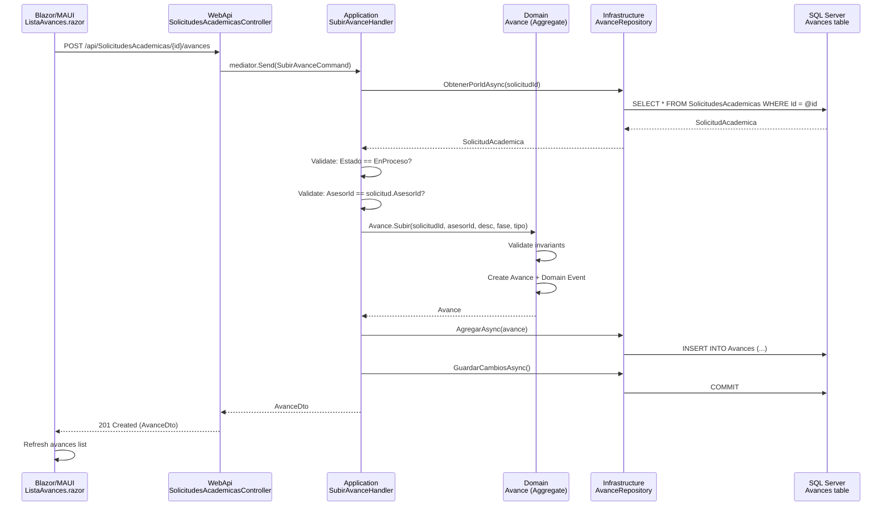

# Use Case: Subir Entregable Parcial / Avance de Fase (Colaborador)

## Functional Perspective

### Purpose
Allow an assigned advisor (Collaborator) to submit partial deliverables and phase progress updates for an active academic request. The client (student) and administrator can view all submitted deliverables, attached files, and participate in discussions through comments.

### Actors
| Actor | Role | Permissions |
|-------|------|-------------|
| **Asesor (Collaborator)** | Assigned to the academic request | Submit deliveries, upload files, post comments |
| **Cliente (Student)** | Owner of the academic request | View deliveries, post comments |
| **Administrador (Admin)** | System administrator | View deliveries, approve/reject deliverables, post comments |

### Usage Guide

#### Step 1: Navigate to the Academic Request Detail
The advisor selects an academic request from their dashboard. The request must be in **"En Proceso" (In Progress)** status. The detail page displays all relevant information including the assigned advisor and, below it, the **Avances y Entregables** (Deliverables) section.

#### Step 2: Submit a New Deliverable
The assigned advisor fills the submission form with:
- **Descripcion** (Description): What was accomplished in this phase
- **Fase** (Phase number): Sequential number (e.g., 1, 2, 3)
- **Tipo** (Type): **Parcial** (intermediate) or **Final** (final submission)

The advisor clicks **"Subir Entregable"** and the system creates the deliverable record.

#### Step 3: Upload Supporting Files (Optional)
After submitting a deliverable, the advisor can attach files (PDF, DOCX, etc.) to provide evidence of the work completed.

#### Step 4: Review and Comment
All participants can expand the comments section for any deliverable to:
- View existing comments from all parties
- Post new comments for discussion

#### Step 5: Administrator Review
The administrator can review each deliverable and:
- **Approve** it (changes status to "Approved")
- **Reject** it (changes status to "Rejected")

### Business Rules

| Rule | Description |
|------|-------------|
| **Solicitud must be in EnProceso** | Deliverables can only be uploaded to requests that are actively in progress |
| **Only the assigned advisor** | Only the advisor explicitly assigned to the request can submit deliverables |
| **Non-empty description** | A description of the advance is mandatory |
| **Valid phase number** | Phase number must be 1 or greater |
| **Comments allowed for all** | Any participant (student, advisor, admin) can comment on any deliverable |
| **Approval state machine** | A deliverable starts as PendienteRevision, can be moved to Approbado or Rechazado by an admin only |
| **Immutable after review** | Once approved or rejected, the status cannot be changed again |
| **File size validation** | Uploaded files must have a valid size (> 0 bytes), name, URL, and content type |

### Flowchart

```mermaid
graph TD
    A[Advisor views Solicitud Detail] --> B{Is Solicitud in EnProceso?}
    B -- No --> C[Deliverables section hidden]
    B -- Yes --> D{Is user the assigned advisor?}
    D -- Yes --> E[Show submission form]
    D -- No --> F[View deliverables only]
    E --> G[Fill: Description, Phase, Type]
    G --> H[Click "Subir Entregable"]
    H --> I[System validates inputs]
    I --> J{Valid?}
    J -- No --> K[Show validation errors]
    J -- Yes --> L[Avance created with PendienteRevision]
    L --> M[Upload files & comment as needed]
    M --> N[All participants can view and comment]
    N --> O{Admin reviews}
    O -- Approve --> P[Status: Aprobado]
    O -- Reject --> Q[Status: Rechazado]
    P --> R[History visible in timeline]
    Q --> R
```

---

## Technical Perspective

### Component Map

| Layer | Project | File | Responsibility |
|:------|:--------|:-----|:---------------|
| Domain | `GrupoXpert.Domain` | `Academia/Avance.cs` | Aggregate Root: factory `Subir()`, invariants, state machine |
| Domain | `GrupoXpert.Domain` | `Academia/Comentario.cs` | Child Entity: comment creation and validation |
| Domain | `GrupoXpert.Domain` | `Academia/ArchivoAdjunto.cs` | Child Entity: file attachment metadata and validation |
| Domain | `GrupoXpert.Domain` | `Academia/EstadoAvance.cs` | Enum: PendienteRevision(1), Aprobado(2), Rechazado(3) |
| Domain | `GrupoXpert.Domain` | `Academia/TipoAvance.cs` | Enum: Parcial(1), Final(2) |
| Domain | `GrupoXpert.Domain` | `Academia/IAvanceRepository.cs` | Repository Interface |
| Domain | `GrupoXpert.Domain` | `Academia/Events/AvanceSubidoDomainEvent.cs` | Event emitted on delivery creation |
| Domain | `GrupoXpert.Domain` | `Academia/Events/ComentarioAgregadoDomainEvent.cs` | Event emitted on comment creation |
| Application | `GrupoXpert.Application` | `Academia/Commands/SubirAvanceCommand.cs` | Input DTO for creating a deliverable |
| Application | `GrupoXpert.Application` | `Academia/Commands/SubirAvanceHandler.cs` | Orchestrates: validates solicitud state, creates Avance, persists |
| Application | `GrupoXpert.Application` | `Academia/Commands/AgregarComentarioCommand.cs` | Input DTO for adding a comment |
| Application | `GrupoXpert.Application` | `Academia/Commands/AgregarComentarioHandler.cs` | Orchestrates: loads Avance, calls domain method, persists |
| Application | `GrupoXpert.Application` | `Academia/Commands/AgregarArchivoCommand.cs` | Input DTO for attaching a file |
| Application | `GrupoXpert.Application` | `Academia/Commands/AgregarArchivoHandler.cs` | Orchestrates: loads Avance, calls domain method, persists |
| Application | `GrupoXpert.Application` | `Academia/Commands/AprobarAvanceCommand.cs` | Input DTO for approval |
| Application | `GrupoXpert.Application` | `Academia/Commands/AprobarAvanceHandler.cs` | Orchestrates: loads Avance, calls Aprobar(), persists |
| Application | `GrupoXpert.Application` | `Academia/Commands/RechazarAvanceCommand.cs` | Input DTO for rejection |
| Application | `GrupoXpert.Application` | `Academia/Commands/RechazarAvanceHandler.cs` | Orchestrates: loads Avance, calls Rechazar(), persists |
| Application | `GrupoXpert.Application` | `Academia/Dtos/AvanceDto.cs` | Output DTO for deliverable data |
| Application | `GrupoXpert.Application` | `Academia/Dtos/ComentarioDto.cs` | Output DTO for comment data |
| Application | `GrupoXpert.Application` | `Academia/Dtos/ArchivoAdjuntoDto.cs` | Output DTO for file metadata |
| Application | `GrupoXpert.Application` | `Academia/Queries/ObtenerAvancesPorSolicitudQuery.cs` | Query input |
| Application | `GrupoXpert.Application` | `Academia/Queries/ObtenerAvancesPorSolicitudHandler.cs` | Resolves names, maps to DTOs with comments and files |
| Infrastructure | `GrupoXpert.Infrastructure` | `Persistence/Repositories/AvanceRepository.cs` | EF Core implementation of IAvanceRepository |
| Infrastructure | `GrupoXpert.Infrastructure` | `Persistence/Configurations/AvanceConfiguracion.cs` | EF mapping for Avances table |
| Infrastructure | `GrupoXpert.Infrastructure` | `Persistence/Configurations/ComentarioConfiguracion.cs` | EF mapping for Comentarios table |
| Infrastructure | `GrupoXpert.Infrastructure` | `Persistence/Configurations/ArchivoAdjuntoConfiguracion.cs` | EF mapping for ArchivosAdjuntos table |
| WebApi | `GrupoXpert.WebApi` | `Controllers/SolicitudesAcademicasController.cs` | REST endpoints for all avance operations |
| Frontend | `GrupoXpert.Shared.UI` | `Componentes/Academia/ListaAvances.razor` | Shared Blazor component (Web + MAUI) |
| Frontend | `GrupoXpert.Web` | `Components/Pages/DetalleSolicitud.razor` | Web page integrating ListaAvances |
| Frontend | `GrupoXpert.Maui` | `Components/Pages/DetalleSolicitud.razor` | Mobile page integrating ListaAvances |
| Database | SQL Server | `[Academia].[Avances]` | Main deliverable table |
| Database | SQL Server | `[Academia].[Comentarios]` | Comments on deliverables |
| Database | SQL Server | `[Academia].[ArchivosAdjuntos]` | File attachments metadata |

### Data Contracts

#### SubirAvanceCommand (Input)
```
SolicitudId : Guid
AsesorId    : Guid (PerfilColaborador.Id)
Descripcion : string
NumeroFase  : int   (>= 1)
Tipo        : int   (1=Parcial, 2=Final)
```

#### AgregarComentarioCommand (Input)
```
AvanceId  : Guid
AutorId   : Guid (Usuario.Id)
Contenido : string
```

#### AgregarArchivoCommand (Input)
```
AvanceId      : Guid
NombreArchivo : string
Url           : string
TamanioBytes  : long
TipoContenido : string (MIME type)
```

#### AvanceDto (Output)
```
Id               : Guid
SolicitudId      : Guid
AsesorId         : Guid
NombreAsesor     : string
Descripcion      : string
NumeroFase       : int
Tipo             : int    (1=Parcial, 2=Final)
Estado           : int    (1=PendienteRevision, 2=Aprobado, 3=Rechazado)
FechaSubida      : DateTime
Comentarios      : List<ComentarioDto>
ArchivosAdjuntos : List<ArchivoAdjuntoDto>
```

### Domain Logic

The core business logic resides in the **Avance** aggregate root:

| Method | Invariant |
|--------|-----------|
| `Avance.Subir()` | SolicitudId not empty, AsesorId not empty, Description not empty, Phase >= 1 |
| `AgregarComentario()` | AutorId not empty, Content not empty |
| `AgregarArchivo()` | Name not empty, URL not empty, Size > 0, ContentType not empty |
| `Aprobar()` | Current state must be PendienteRevision |
| `Rechazar()` | Current state must be PendienteRevision |

In the **SubirAvanceHandler** (Application layer), additional cross-aggregate validations occur:
- The SolicitudAcademica must exist
- The SolicitudAcademica must be in **EnProceso** state
- The requesting AsesorId must match the solicitud's assigned `AsesorId`

### REST Endpoints

| Method | Route | Auth |
|--------|-------|------|
| `GET` | `/api/SolicitudesAcademicas/{id}/avances` | Authorized |
| `POST` | `/api/SolicitudesAcademicas/{id}/avances` | Asesor |
| `POST` | `/api/SolicitudesAcademicas/avances/{avanceId}/comentarios` | Authorized |
| `POST` | `/api/SolicitudesAcademicas/avances/{avanceId}/archivos` | Asesor |
| `POST` | `/api/SolicitudesAcademicas/avances/{avanceId}/aprobar` | Administrador |
| `POST` | `/api/SolicitudesAcademicas/avances/{avanceId}/rechazar` | Administrador |

### Sequence Diagram



### Database Schema

```sql
[Academia].[Avances]
├── Id            UNIQUEIDENTIFIER PK
├── SolicitudId   UNIQUEIDENTIFIER FK → SolicitudesAcademicas
├── AsesorId      UNIQUEIDENTIFIER FK → PerfilesColaboradores
├── Descripcion   NVARCHAR(2000)
├── NumeroFase    INT
├── Tipo          INT  (1=Parcial, 2=Final)
├── Estado        INT  (1=PendienteRevision, 2=Aprobado, 3=Rechazado)
└── FechaSubida   DATETIMEOFFSET

[Academia].[Comentarios]
├── Id            UNIQUEIDENTIFIER PK
├── AvanceId      UNIQUEIDENTIFIER FK → Avances (CASCADE)
├── AutorId       UNIQUEIDENTIFIER FK → Usuarios
├── Contenido     NVARCHAR(4000)
└── FechaCreacion DATETIMEOFFSET

[Academia].[ArchivosAdjuntos]
├── Id            UNIQUEIDENTIFIER PK
├── AvanceId      UNIQUEIDENTIFIER FK → Avances (CASCADE)
├── NombreArchivo NVARCHAR(500)
├── Url           NVARCHAR(2000)
├── TamanioBytes  BIGINT
├── TipoContenido NVARCHAR(200)
└── FechaSubida   DATETIMEOFFSET
```

### Test Coverage

| Test File | Tests | Coverage |
|-----------|-------|----------|
| `Domain/Academia/AvanceTests.cs` | 22 | Factory method, comments, files, approve/reject state machine, all invariants |
| `Application/Academia/Commands/SubirAvanceHandlerTests.cs` | 4 | Success path, missing solicitud, wrong state, unauthorized advisor |
| `Application/Academia/Commands/AgregarComentarioHandlerTests.cs` | 3 | Success, missing avance, multiple comments |
| `Application/Academia/Commands/AprobarAvanceHandlerTests.cs` | 2 | Success, missing avance |
| `Application/Academia/Commands/RechazarAvanceHandlerTests.cs` | 2 | Success, missing avance |
| `Application/Academia/Queries/ObtenerAvancesPorSolicitudHandlerTests.cs` | 5 | With data, empty, with comments, with files, multiple avances |
| **Total** | **38** | Domain + Application handlers |
