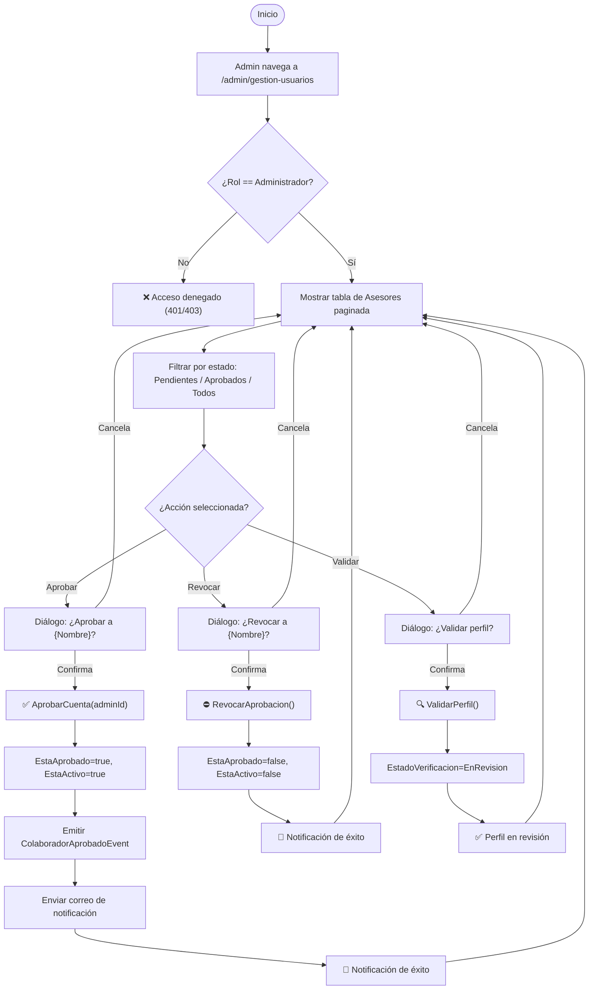
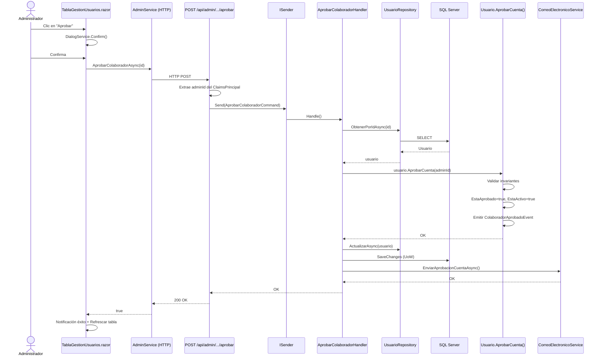

# Caso de Uso: Validar Perfil de Colaborador (Proceso de Aprobación Interno)

> **Módulo:** Identidad | **Contexto Delimitado:** IDENTIDAD | **Versión:** 2.0 (Implementación Final)  
> **Última actualización:** 2026-05-06  
> **Estado:** ✅ Implementado, Probado y Auditado (QA)

---

## 👥 Perspectiva Funcional (Manual de Usuario)

### Objetivo

Permitir que un usuario con rol **Administrador** gestione las cuentas de colaboradores (Asesores) a través de una pantalla exclusiva de **Gestión de Usuarios**. El sistema distingue entre la **Aprobación de la Cuenta** (permiso de acceso) y la **Verificación del Perfil** (proceso de calidad de datos).

---

### 💡 Conceptos Clave: Aprobación vs. Verificación

| Concepto | Tipo | Descripción | Analogía |
| :--- | :---: | :--- | :--- |
| **Aprobación** | `EstaAprobado` (bool) | Es un estado de **acceso**. Determina si el usuario puede entrar a la plataforma. Sin aprobación, el login está bloqueado. | La **llave** de la oficina. |
| **Verificación** | `EstadoVerificacion` (enum) | Es un estado de **proceso**. Rastrea la etapa de validación de los documentos y el perfil profesional. | El **carnet** de empleado. |

---

### 🚀 Diferencias por Perfil (Automatización)

El sistema aplica reglas diferentes según el tipo de usuario para optimizar la experiencia:

| Perfil | Aprobación de Cuenta | Verificación de Perfil |
| :--- | :--- | :--- |
| **Asesor** | **Manual**: Requiere acción del Administrador. | **Manual**: Flujo Pendiente → Revisión → Aprobado. |
| **Estudiante** | **Automático**: Se aprueba al registrarse. | **Automático**: Se marca como Verificado al registrarse. |
| **Admin** | **Automático**: Posee acceso total inmediato. | **Automático**: Se marca como Verificado. |

> **Acceso restringido:** Esta pantalla es **exclusivamente visible** para el tipo de usuario `Administrador`. Ni el Estudiante ni el Asesor pueden acceder a ella.

---

### Actores

| Actor | Descripción |
| :--- | :--- |
| **Administrador** | Único usuario con acceso a la pantalla de Gestión de Usuarios. Puede ver, aprobar y revocar cuentas de colaboradores. |
| **Asesor (pasivo)** | Recibe una notificación por correo electrónico cuando su cuenta es aprobada. No participa activamente en este flujo. |

---

### Reglas de Negocio

| # | Regla | Consecuencia si se viola |
| :--- | :--- | :--- |
| **RN-01** | Solo los usuarios con `TipoUsuario.Administrador` pueden acceder a la pantalla de Gestión de Usuarios. | El sistema bloquea el acceso con `[Authorize(Roles = "Administrador")]`. |
| **RN-02** | Cuando un Asesor se registra, su cuenta queda en estado `EstaAprobado = false`. | El asesor no puede iniciar sesión hasta ser aprobado. |
| **RN-03** | Los Estudiantes y Administradores se auto-aprueban al registrarse (`EstaAprobado = true`). | N/A — no pasan por este flujo. |
| **RN-04** | Al aprobar un colaborador, el sistema activa la cuenta (`EstaActivo = true`) y registra quién aprobó y cuándo. | Se emite el evento de dominio `ColaboradorAprobadoEvent`. |
| **RN-05** | Al aprobar, se envía un correo de notificación al asesor informando que su cuenta fue activada. | El asesor es notificado vía `ICorreoElectronicoService`. |
| **RN-06** | La revocación desactiva la cuenta (`EstaActivo = false`) y limpia los datos de aprobación. | El asesor pierde acceso a la plataforma. |
| **RN-07** | No se puede aprobar una cuenta que ya está aprobada, ni revocar una que no lo está. | Se lanza `ExcepcionDominio` con mensaje descriptivo. |
| **RN-08** | Solo las cuentas de tipo Asesor pueden ser aprobadas o revocadas. | Se lanza `ExcepcionDominio` si el tipo es diferente. |
| **RN-09** | El estado de verificación debe seguir el flujo: Pendiente → En Revisión → Aprobado/Rechazado. | Se mantiene la trazabilidad del proceso de calidad. |
| **RN-10** | Un Asesor puede estar "Aprobado" (puede entrar) pero tener su perfil aún "En Revisión" (proceso incompleto). | Flexibilidad operativa. |

---

### Guía de Uso

1. El administrador inicia sesión y navega a **`/admin/gestion-usuarios`** desde el menú lateral.
2. El sistema muestra una tabla paginada (Radzen DataGrid) con todos los **Asesores** del sistema mostrando:
   - **Nombre** | **Correo Electrónico** | **Fecha Registro** | **Estado Cuenta** (Activa/Inactiva) | **Aprobación** (Aprobado/Pendiente) | **Acciones**
3. El administrador puede filtrar por estado de aprobación usando el dropdown superior:
   - `Todos` | `Pendientes` | `Aprobados`
4. Para **aprobar** un colaborador pendiente:
   - Hace clic en el botón verde **"✓ Aprobar"** en la fila correspondiente.
   - El sistema muestra un diálogo de confirmación: *"¿Desea aprobar la cuenta del colaborador {Nombre}?"*
   - Al confirmar, la cuenta se activa y se envía correo de notificación.
   - Se muestra una notificación de éxito en pantalla.
5. Para **revocar** la aprobación de un colaborador activo:
   - Hace clic en el botón rojo **"✗ Revocar"** en la fila correspondiente.
   - El sistema muestra un diálogo de confirmación.
   - Al confirmar, la cuenta se desactiva y los datos de aprobación se limpian.
6. Para **validar/verificar** un perfil:
   - El administrador puede cambiar el filtro a "Estado de Verificación" para ver quiénes están en revisión.
   - Puede usar el botón **"Validar Perfil"** para mover un usuario de "Pendiente" a "En Revisión".

---

### Diagrama de Flujo



---

## 💻 Perspectiva Técnica (Guía del Desarrollador)

### Mapa de Componentes (Implementación Real)

| Capa | Proyecto | Archivo | Responsabilidad |
| :--- | :--- | :--- | :--- |
| **Dominio** | `GrupoXpert.Domain` | `Identidad/TipoUsuario.cs` | Enum con valores: `Estudiante=1`, `Asesor=2`, `Administrador=3` |
| **Dominio** | `GrupoXpert.Domain` | `Identidad/Usuario.cs` | Agregado raíz con props `EstaAprobado`, `FechaAprobacion`, `AprobadoPorId` y métodos `AprobarCuenta()`, `RevocarAprobacion()` |
| **Dominio** | `GrupoXpert.Domain` | `Identidad/Events/ColaboradorAprobadoEvent.cs` | Evento de dominio emitido al aprobar |
| **Dominio** | `GrupoXpert.Domain` | `Identidad/EstadoVerificacion.cs` | Enum: `Pendiente=1`, `Verificado=2`, `Rechazado=3`, `Aprobado=4`, `EnRevision=5` |
| **Dominio** | `GrupoXpert.Domain` | `Identidad/IUsuarioRepository.cs` | Contrato con `ObtenerPaginadoAsync()` (incluye filtros de verificación) |
| **Aplicación** | `GrupoXpert.Application` | `Identidad/Commands/AprobarColaboradorCommand.cs` | Comando CQRS `(ColaboradorId, AdministradorId)` |
| **Aplicación** | `GrupoXpert.Application` | `Identidad/Commands/AprobarColaboradorHandler.cs` | Handler: busca → aprueba → persiste → envía correo |
| **Aplicación** | `GrupoXpert.Application` | `Identidad/Commands/RevocarAprobacionCommand.cs` | Comando CQRS `(ColaboradorId, AdministradorId)` |
| **Aplicación** | `GrupoXpert.Application` | `Identidad/Commands/RevocarAprobacionHandler.cs` | Handler: busca → revoca → persiste |
| **Aplicación** | `GrupoXpert.Application` | `Identidad/Queries/ObtenerUsuariosPaginadoQuery.cs` | Query CQRS con filtros `(Tipo?, EstaAprobado?, Pagina, TamanoPagina)` |
| **Aplicación** | `GrupoXpert.Application` | `Identidad/Queries/ObtenerUsuariosPaginadoHandler.cs` | Handler: pagina → mapea a DTO |
| **Aplicación** | `GrupoXpert.Application` | `Identidad/Dtos/UsuarioListaDto.cs` | DTO record para la tabla de gestión |
| **Aplicación** | `GrupoXpert.Application` | `Common/Dtos/ResultadoPaginadoDto.cs` | DTO genérico de paginación |
| **Aplicación** | `GrupoXpert.Application` | `Common/Interfaces/ICorreoElectronicoService.cs` | Contrato con `EnviarAprobacionCuentaAsync()` |
| **Infraestructura** | `GrupoXpert.Infrastructure` | `Persistence/Configurations/UsuarioConfiguration.cs` | Mapeo EF Core de nuevas columnas + FK self-referencing |
| **Infraestructura** | `GrupoXpert.Infrastructure` | `Persistence/Repositories/UsuarioRepository.cs` | Implementación de `ObtenerPaginadoAsync` con `AsNoTracking`, `Skip/Take` |
| **Infraestructura** | `GrupoXpert.Infrastructure` | `Services/CorreoElectronicoService.cs` | Implementación mock de `EnviarAprobacionCuentaAsync` (via `ILogger`) |
| **API** | `GrupoXpert.WebApi` | `Program.cs` | Grupo `/api/admin` con `RequireRole("Administrador")` |
| **UI Compartida** | `GrupoXpert.Shared.UI` | `Componentes/Identidad/TablaGestionUsuarios.razor` | DataGrid Radzen con filtros, paginación, diálogos y badges |
| **UI Compartida** | `GrupoXpert.Shared.UI` | `Abstracciones/IAdminService.cs` | Contrato de servicio HTTP para la UI |
| **UI Compartida** | `GrupoXpert.Shared.UI` | `Modelos/IdentidadModelos.cs` | Enums locales (`EstadoVerificacionUI`, `TipoUsuarioUI`) y DTOs desacoplados del dominio |
| **Presentación Web** | `GrupoXpert.Web` | `Components/Pages/GestionUsuarios.razor` | Página protegida `@attribute [Authorize(Roles = "Administrador")]` |
| **Presentación Web** | `GrupoXpert.Web` | `Services/AdminService.cs` | Implementación HTTP de `IAdminService` |
| **Tests Dominio** | `GrupoXpert.UnitTests` | `Domain/Identidad/UsuarioTests.cs` | 11 pruebas unitarias de invariantes de aprobación |
| **Tests Aplicación** | `GrupoXpert.UnitTests` | `Application/Identidad/Commands/AprobarColaboradorHandlerTests.cs` | 3 pruebas del handler de aprobación |
| **Tests Aplicación** | `GrupoXpert.UnitTests` | `Application/Identidad/Commands/RevocarAprobacionHandlerTests.cs` | 3 pruebas del handler de revocación |

---

### Contrato de Datos

#### Comando — `AprobarColaboradorCommand`

```csharp
public sealed record AprobarColaboradorCommand(
    Guid ColaboradorId,       // ID del asesor a aprobar
    Guid AdministradorId      // ID del admin que ejecuta la acción (extraído del JWT)
) : IRequest;
```

#### Comando — `RevocarAprobacionCommand`

```csharp
public sealed record RevocarAprobacionCommand(
    Guid ColaboradorId,
    Guid AdministradorId
) : IRequest;
```

#### Query — `ObtenerUsuariosPaginadoQuery`

```csharp
public sealed record ObtenerUsuariosPaginadoQuery(
    TipoUsuario? Tipo = null,
    bool? EstaAprobado = null,
    EstadoVerificacion? EstadoVerificacion = null,
    int Pagina = 1,
    int TamanoPagina = 20
) : IRequest<ResultadoPaginadoDto<UsuarioListaDto>>;
```

#### DTO — `UsuarioListaDto`

```csharp
public sealed record UsuarioListaDto(
    Guid Id,
    string Nombre,
    string Correo,
    TipoUsuario Tipo,
    bool EstaActivo,
    bool EstaAprobado,
    EstadoVerificacion EstadoVerificacion,
    DateTimeOffset FechaCreacion,
    DateTimeOffset? FechaAprobacion
);
```

#### DTO — `ResultadoPaginadoDto<T>`

```csharp
public sealed record ResultadoPaginadoDto<T>(
    IReadOnlyList<T> Elementos,
    int TotalRegistros,
    int Pagina,
    int TamanoPagina
);
```

---

### Endpoints REST Implementados

| Método | Ruta | Protección | Descripción |
| :--- | :--- | :--- | :--- |
| `GET` | `/api/admin/usuarios?tipo=2&estaAprobado=false&pagina=1&tamanoPagina=20` | `RequireRole("Administrador")` | Lista paginada de usuarios filtrada |
| `POST` | `/api/admin/colaboradores/{id:guid}/aprobar` | `RequireRole("Administrador")` | Aprueba cuenta de asesor |
| `POST` | `/api/admin/colaboradores/{id:guid}/revocar` | `RequireRole("Administrador")` | Revoca aprobación de asesor |

**Respuesta exitosa de aprobación (`200 OK`):**
```json
{ "mensaje": "Colaborador aprobado exitosamente." }
```

**Respuesta exitosa de revocación (`200 OK`):**
```json
{ "mensaje": "Aprobación revocada exitosamente." }
```

**Respuesta de error (`400 BadRequest`):**
```json
{ "mensaje": "Solo las cuentas de tipo Asesor requieren aprobación." }
```

---

### Lógica de Dominio

La lógica de negocio reside exclusivamente en el **Agregado `Usuario`** dentro del Bounded Context `Identidad`:

#### Lógica de Inicialización (Constructor)
1. **Estudiantes/Admins**: Se establecen como `EstaAprobado = true` y `EstadoVerificacion = Aprobado` de forma automática.
2. **Asesores**: Se establecen como `EstaAprobado = false` y `EstadoVerificacion = Pendiente`.

#### Método `AprobarCuenta(Guid administradorId)`
1. Valida que `Tipo == Asesor` (invariante de tipo)
2. Valida que `EstaAprobado == false` (invariante de idempotencia)
3. Establece `EstaAprobado = true`, `EstaActivo = true`
4. Registra `FechaAprobacion` y `AprobadoPorId`
5. Invalida el token de activación
6. Emite `ColaboradorAprobadoEvent`

#### Método `RevocarAprobacion()`
1. Valida que `Tipo == Asesor`
2. Valida que `EstaAprobado == true`
3. Establece `EstaAprobado = false`, `EstaActivo = false`
4. Limpia `FechaAprobacion` y `AprobadoPorId`

#### Impacto en `RegistrarInicioSesion()`
- Si `Tipo == Asesor && !EstaAprobado` → lanza `ExcepcionDominio("Tu cuenta está pendiente de aprobación por un administrador.")`

---

### Diagrama de Secuencia



---

### Esquema de Base de Datos

**Tabla: `Identidad.Usuarios`** — Columnas agregadas

| Columna | Tipo SQL | Restricciones | Descripción |
| :--- | :--- | :--- | :--- |
| `EstaAprobado` | `BIT` | `NOT NULL`, `DEFAULT 0` | Indica si un admin aprobó la cuenta |
| `FechaAprobacion` | `DATETIMEOFFSET` | `NULL` | Fecha/hora UTC de aprobación |
| `AprobadoPorId` | `UNIQUEIDENTIFIER` | `NULL`, `FK → Identidad.Usuarios(Id)` | ID del admin que aprobó |

**Índice optimizado:**
```sql
CREATE INDEX [IX_Usuarios_Tipo_EstaAprobado] 
    ON [Identidad].[Usuarios] ([Tipo], [EstaAprobado]) 
    INCLUDE ([Nombre], [Email], [FechaCreacion]);
```

---

### Cobertura de Pruebas (Implementada)

| Suite | Archivo | Pruebas | Resultado |
| :--- | :--- | :--- | :--- |
| **Dominio** | `UsuarioTests.cs` | 11 | ✅ 11/11 Correctas |
| **Aplicación** | `AprobarColaboradorHandlerTests.cs` | 3 | ✅ 3/3 Correctas |
| **Aplicación** | `RevocarAprobacionHandlerTests.cs` | 3 | ✅ 3/3 Correctas |
| **Total** | — | **17** | ✅ **17/17 Correctas (0.66s)** |

#### Detalle de pruebas de Dominio

| Test | Escenario validado |
| :--- | :--- |
| `Crear_CuandoTipoEsEstudiante_DebeAutoAprobarse` | Estudiantes se auto-aprueban |
| `Crear_CuandoTipoEsAsesor_NoDebeEstarAprobado` | Asesores inician pendientes |
| `AprobarCuenta_CuandoEsAsesorPendiente_DebeAprobarYActivar` | Happy path: aprobación completa |
| `AprobarCuenta_CuandoEsAsesor_DebeEmitirEventoColaboradorAprobado` | Evento de dominio emitido |
| `AprobarCuenta_CuandoYaEstaAprobado_DebeLanzarExcepcionDominio` | Idempotencia protegida |
| `AprobarCuenta_CuandoEsEstudiante_DebeLanzarExcepcionDominio` | Tipo incorrecto rechazado |
| `RevocarAprobacion_CuandoEstaAprobado_DebeDesaprobarYDesactivar` | Happy path: revocación completa |
| `RevocarAprobacion_CuandoNoEstaAprobado_DebeLanzarExcepcionDominio` | Invariante protegida |
| `RevocarAprobacion_CuandoEsEstudiante_DebeLanzarExcepcionDominio` | Tipo incorrecto rechazado |
| `RegistrarInicioSesion_CuandoAsesorNoAprobado_DebeLanzarExcepcionDominio` | Login bloqueado sin aprobación |
| `RegistrarInicioSesion_CuandoAsesorAprobado_DebeRegistrarSesion` | Login permitido tras aprobación |

#### Detalle de pruebas de Aplicación

| Test | Escenario validado |
| :--- | :--- |
| `Handle_CuandoColaboradorExiste_DebeAprobarYGuardar` | Repositorio y UoW invocados |
| `Handle_CuandoColaboradorExiste_DebeEnviarCorreoDeAprobacion` | ICorreoElectronicoService invocado |
| `Handle_CuandoColaboradorNoExiste_DebeLanzarExcepcionDominio` | Sin persistencia, excepción propagada |
| `Handle_CuandoColaboradorAprobado_DebeRevocarYGuardar` | Repositorio y UoW invocados |
| `Handle_CuandoColaboradorNoExiste_DebeLanzarExcepcionDominio` | Sin persistencia, excepción propagada |
| `Handle_CuandoColaboradorNoPendiente_DebePropalarExcepcionDominio` | Excepción de dominio propagada |

---

### Auditoría QA

| Aspecto | Estado | Observación |
| :--- | :--- | :--- |
| Nomenclatura Ubicua (Español) | ✅ | Entidades, métodos, variables y DTOs en español |
| Nomenclatura Estructural (Inglés) | ✅ | Carpetas, interfaces, sufijos en inglés |
| Invasión de Capas | ✅ | Dominio NO referencia Infraestructura |
| CQRS con MediatR | ✅ | Commands y Queries separados con handlers |
| Componentes en Shared.UI | ✅ | `TablaGestionUsuarios.razor` reutilizable |
| Minimal APIs en WebApi | ✅ | Grupo `/api/admin` con protección por rol |
| Build sin errores | ✅ | 0 errores, 0 warnings de compilación propios |

---

> **Nota de Seguridad:** Todos los endpoints bajo `/api/admin/*` están protegidos con `RequireAuthorization(policy => policy.RequireRole("Administrador"))` a nivel de grupo. El ID del administrador se extrae del `ClaimsPrincipal` (JWT) para garantizar trazabilidad.
