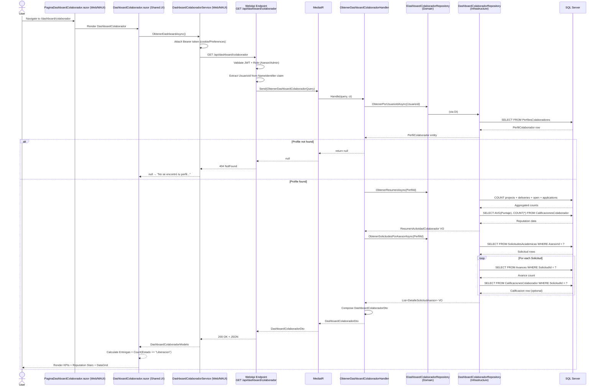

# Use Case: Visualizar Dashboard de Colaborador

## 👥 Functional Perspective (User Manual)

### Purpose
Allow an **Advisor (Asesor)** or **Administrator** to view a consolidated dashboard that summarizes their academic activity: projects in progress, completed deliveries (released to the client), open requests, pending applications, academic reputation, and the detailed list of assigned requests. This provides a single source of truth for the collaborator's performance and workload.

### Actors
| Actor | Role |
| :--- | :--- |
| **Asesor** (Advisor) | Main actor. Views their own dashboard to track active projects, reputation, and deliveries. |
| **Administrador** (Administrator) | Can also view the dashboard (same endpoint, role-based authorization). |

### Usage Guide

#### Web Application
1. The user logs in with an account that has the role **"Asesor"** or **"Administrador"**.
2. In the top navigation bar, clicks on **"Mi Panel"** (or navigates to `/dashboard/colaborador`).
3. The system displays the dashboard with the following sections:
   - **KPI Cards**: A summary row showing:
     - **En Curso** — Number of active projects (requests in `EnProceso` state assigned to this advisor).
     - **Entregas** — Number of requests in `Liberacion` state (delivered/released to the client).
     - **Abiertas** — Number of open requests assigned to the advisor.
     - **Postulaciones Pendientes** — Pending applications the advisor has submitted.
   - **Reputación Académica** — Star rating (1-5), average score, total number of ratings received, and calculated level (Beginner → Expert).
   - **Mis Solicitudes** — A data grid (RadzenDataGrid) with all assigned requests showing: Area, Type, Status, Delivery Date, Urgency, Number of Deliveries, and Client Score.
4. The user can click **"Ver"** on any request row to navigate to the request detail page.

#### MAUI Mobile Application
1. The user logs in on the mobile app.
2. Taps the **"Mi Panel"** icon in the bottom tab bar (or navigates to `/dashboard/colaborador`).
3. The same dashboard sections are displayed, adapted to the mobile viewport.
4. If the user's role is not Asesor/Admin, the app redirects to the home page.

### Business Rules
1. **Role-based access**: Only users with role `Asesor` or `Administrador` can access the dashboard. Others receive 403/Unauthorized or are redirected.
2. **Profile existence**: If the user does not have a `PerfilColaborador` record, the system shows a friendly message: *"No se encontró tu perfil de colaborador. Si eres asesor, asegúrate de que tu perfil ha sido aprobado."*
3. **Reputation calculation**: The reputation level is automatically derived from the average score:
   - No ratings → "Sin Calificar"
   - Score < 2.5 → "Principiante"
   - 2.5 ≤ Score < 3.5 → "Intermedio"
   - 3.5 ≤ Score < 4.5 → "Avanzado"
   - Score ≥ 4.5 → "Experto"
4. **Deliveries count**: The "Entregas" KPI counts requests in `Liberacion` state (delivered to the client), NOT internal advance submissions.
5. **Empty states**: If the advisor has no assigned requests, the grid shows an empty inbox message instead of an error.
6. **JWT authorization**: The endpoint requires a valid Bearer token with `Asesor` or `Administrador` role claim.

### Functional Flowchart

```mermaid
graph TD
    A[User logs in as Asesor/Admin] --> B{Clicks "Mi Panel"}
    B --> C[Web/MAUI calls GET /api/dashboard/colaborador]
    C --> D{Valid JWT + Role?}
    D -- No --> E[Return 403 Unauthorized]
    D -- Yes --> F[Extract UsuarioId from JWT]
    F --> G[Find PerfilColaborador by UsuarioId]
    G --> H{Profile exists?}
    H -- No --> I[Return 404 - Show friendly message]
    H -- Yes --> J[Query Resumen: projects, deliveries, open requests, applications]
    J --> K[Query Reputation: average score + total ratings]
    J --> L[Query Solicitudes: assigned requests with details]
    K --> M[Build Dashboard DTO]
    L --> M
    M --> N[Return JSON to Client]
    N --> O[UI renders KPIs + Reputation + DataGrid]
    O --> P[User views dashboard / clicks "Ver" on a request]
```

---

## 💻 Technical Perspective (Developer Guide)

### Component Map

| Layer | Project | File | Responsibility |
| :--- | :--- | :--- | :--- |
| **Presentation (Web Page)** | `GrupoXpert.Web` | `Components/Pages/PaginaDashboardColaborador.razor` | Host page for Web. Applies `[Authorize(Roles="Asesor,Administrador")]` and renders `DashboardColaborador` shared component. |
| **Presentation (MAUI Page)** | `GrupoXpert.Maui` | `Components/Pages/PaginaDashboardColaborador.razor` | Host page for MAUI. Decodes JWT role from `Preferences` or token payload; redirects non-authorized users. |
| **Presentation (Shared UI)** | `GrupoXpert.Shared.UI` | `Componentes/Perfil/DashboardColaborador.razor` | Main dashboard component. Calls `IDashboardColaboradorService`, renders KPI cards, reputation section, and RadzenDataGrid. |
| **Presentation (Shared UI)** | `GrupoXpert.Shared.UI` | `Componentes/Layout/TarjetaPerfil.razor` | Profile side-card. Auto-loads dashboard stats for Asesor/Admin roles via `IDashboardColaboradorService`. |
| **Client Service (Web)** | `GrupoXpert.Web` | `Services/DashboardColaboradorService.cs` | Injects `Bearer` token from `HttpContext` cookie into `HttpClient`; calls `GET api/dashboard/colaborador`. |
| **Client Service (MAUI)** | `GrupoXpert.Maui` | `Services/DashboardColaboradorService.cs` | Injects `Bearer` token from `Preferences` (`authToken`) into `HttpClient`; calls `GET api/dashboard/colaborador`. |
| **Abstraction** | `GrupoXpert.Shared.UI` | `Abstracciones/IDashboardColaboradorService.cs` | Interface contract: `Task<DashboardColaboradorModelo?> ObtenerDashboardAsync()`. |
| **WebApi Endpoint** | `GrupoXpert.WebApi` | `Program.cs` (lines 232–244) | Minimal API: `GET /api/dashboard/colaborador`. Extracts `NameIdentifier` claim, sends `ObtenerDashboardColaboradorQuery`. |
| **Application (Query)** | `GrupoXpert.Application` | `Perfil/Queries/ObtenerDashboardColaboradorQuery.cs` | MediatR query record: `ObtenerDashboardColaboradorQuery(Guid UsuarioId)`. |
| **Application (Handler)** | `GrupoXpert.Application` | `Perfil/Queries/ObtenerDashboardColaboradorHandler.cs` | Orchestrates: fetches `PerfilColaborador`, then calls repository for summary, reputation, and request list. Composes `DashboardColaboradorDto`. |
| **Application (DTO)** | `GrupoXpert.Application` | `Perfil/Dtos/DashboardColaboradorDto.cs` | Data transfer object: `DashboardColaboradorDto`, `ReputacionAcademicaDto`, `DetalleSolicitudAsesorDto`. |
| **Domain (Repository Interface)** | `GrupoXpert.Domain` | `Perfil/IDashboardColaboradorRepository.cs` | Read-model repository contract: `ObtenerResumenAsync`, `ObtenerReputacionAsync`, `ObtenerSolicitudesPorAsesorAsync`. |
| **Domain (Value Object)** | `GrupoXpert.Domain` | `Perfil/ResumenActividadColaborador.cs` | VO encapsulating dashboard KPIs with validation (no negative counts). |
| **Domain (Value Object)** | `GrupoXpert.Domain` | `Perfil/ReputacionAcademica.cs` | VO with score (0-5), total ratings, and auto-calculated `NivelReputacion`. |
| **Domain (Value Object)** | `GrupoXpert.Domain` | `Perfil/DetalleSolicitudAsesor.cs` | VO representing a single request row in the dashboard grid. |
| **Domain (Enum)** | `GrupoXpert.Domain` | `Perfil/NivelReputacion.cs` | Enum: `SinCalificar`, `Principiante`, `Intermedio`, `Avanzado`, `Experto`. |
| **Infrastructure (Repository)** | `GrupoXpert.Infrastructure` | `Persistence/Repositories/DashboardColaboradorRepository.cs` | Implementation composing data from `ISolicitudAcademicaRepository`, `IAvanceRepository`, and `ICalificacionColaboradorRepository`. |
| **Infrastructure (DI)** | `GrupoXpert.Infrastructure` | `DependencyInjection.cs` (line 42) | Registers `IDashboardColaboradorRepository` → `DashboardColaboradorRepository`. |
| **Database (SQL)** | `docs/sql` | `AlterTablaDashboardColaborador.sql` | Adds `PuntajePromedioReputacion`, `TotalCalificacionesReputacion`, `NivelReputacion` columns to `Perfil.PerfilesColaboradores` + 5 performance indexes. |
| **Tests** | `GrupoXpert.UnitTests` | `Application/Perfil/Queries/ObtenerDashboardColaboradorHandlerTests.cs` | 7 unit tests covering: happy path, empty requests, urgent request, scored request, missing profile, missing summary, new user with zero activity. |
| **Styles (Web)** | `GrupoXpert.Web` | `wwwroot/app.css` | Dashboard-specific CSS: `.gx-dashboard-kpis`, `.gx-kpi-card`, `.gx-reputacion-puntaje`, `.gx-estado-badge` variants. |

### Data Contract

**Input:** `ObtenerDashboardColaboradorQuery(Guid UsuarioId)`
- The `UsuarioId` is extracted from the JWT `NameIdentifier` claim by the WebApi endpoint; the UI does not pass it explicitly.

**Output:** `DashboardColaboradorDto`

```csharp
public class DashboardColaboradorDto
{
    public Guid PerfilColaboradorId { get; set; }
    public Guid UsuarioId { get; set; }
    public int ProyectosEnCurso { get; set; }
    public int EntregasRealizadas { get; set; }
    public int SolicitudesAbiertas { get; set; }
    public int PostulacionesPendientes { get; set; }
    public ReputacionAcademicaDto Reputacion { get; set; } = new();
    public List<DetalleSolicitudAsesorDto> Solicitudes { get; set; } = [];
}
```

### Domain Logic

The core business logic resides in **Value Objects** (immutable, validated):

1. **`ReputacionAcademica`** (`Domain/Perfil/ReputacionAcademica.cs`)
   - Validates: `0 ≤ PuntajePromedio ≤ 5`
   - Validates: `TotalCalificaciones ≥ 0`
   - Auto-calculates `Nivel` via `DeterminarNivel()`:
     ```csharp
     if (totalCalificaciones == 0) => SinCalificar
     if (puntaje >= 4.5m) => Experto
     if (puntaje >= 3.5m) => Avanzado
     if (puntaje >= 2.5m) => Intermedio
     else => Principiante
     ```
   - Exposes `Recalcular(IEnumerable<int> puntajes)` for batch recalculation.

2. **`ResumenActividadColaborador`** (`Domain/Perfil/ResumenActividadColaborador.cs`)
   - Validates all counts are non-negative.
   - Wraps `ReputacionAcademica` as part of the summary.
   - Implements `ValueObject` equality based on all components.

3. **`DetalleSolicitudAsesor`** (`Domain/Perfil/DetalleSolicitudAsesor.cs`)
   - Immutable VO representing a flattened read-model of a request.
   - Contains: `SolicitudId`, `TipoTrabajo`, `AreaTematica`, `Estado`, `FechaEntrega`, `EsUrgente`, `NumeroEntregas`, `PuntajeCalificacion`.

### Sequence Diagram



### Architecture Notes

- **Clean Architecture**: The Application layer depends only on Domain abstractions (`IDashboardColaboradorRepository`, `IPerfilColaboradorRepository`). Infrastructure implements the repository by composing existing domain repositories (`ISolicitudAcademicaRepository`, `IAvanceRepository`, `ICalificacionColaboradorRepository`), avoiding raw SQL and maintaining consistency.
- **CQRS with MediatR**: The dashboard is a read-only query (`IRequest<DashboardColaboradorDto?>`) handled by `ObtenerDashboardColaboradorHandler`. No commands or state mutations occur.
- **Shared UI Component**: `DashboardColaborador.razor` lives in `Shared.UI` and is reused by both Web (InteractiveServer) and MAUI. Platform-specific auth logic is abstracted behind `IDashboardColaboradorService`.
- **MAUI Auth Compatibility**: The MAUI page includes a JWT decode fallback (`ObtenerRolUsuario()`) for backward compatibility with sessions created before `usuarioRol` was stored in `Preferences`.
- **Database Performance**: The SQL script adds 5 non-clustered indexes on `SolicitudesAcademicas`, `Postulaciones`, and `Avances` to optimize the aggregation queries executed by the repository.

### Related Files Quick Reference

```
Domain:
  Perfil/ReputacionAcademica.cs              → VO: score validation + level calculation
  Perfil/ResumenActividadColaborador.cs      → VO: KPI summary with non-negative validation
  Perfil/DetalleSolicitudAsesor.cs           → VO: flattened request row
  Perfil/NivelReputacion.cs                  → Enum: reputation levels
  Perfil/IDashboardColaboradorRepository.cs  → Repository interface

Application:
  Perfil/Dtos/DashboardColaboradorDto.cs     → DTOs
  Perfil/Queries/ObtenerDashboardColaboradorQuery.cs     → MediatR Query
  Perfil/Queries/ObtenerDashboardColaboradorHandler.cs   → Handler orchestration

Infrastructure:
  Persistence/Repositories/DashboardColaboradorRepository.cs  → Repository impl
  DependencyInjection.cs                                     → DI registration

WebApi:
  Program.cs  → Minimal API endpoint (lines 232–244)

Shared.UI:
  Componentes/Perfil/DashboardColaborador.razor      → Main dashboard UI
  Componentes/Layout/TarjetaPerfil.razor             → Profile card with auto-stats
  Modelos/Perfil/DashboardColaboradorModelo.cs       → UI models
  Abstracciones/IDashboardColaboradorService.cs      → Service contract

Web:
  Components/Pages/PaginaDashboardColaborador.razor  → Host page
  Services/DashboardColaboradorService.cs            → HTTP client with cookie auth
  wwwroot/app.css                                    → Dashboard CSS

MAUI:
  Components/Pages/PaginaDashboardColaborador.razor  → Host page + role guard
  Services/DashboardColaboradorService.cs            → HTTP client with Preferences auth

Database:
  docs/sql/AlterTablaDashboardColaborador.sql        → ALTER TABLE + indexes

Tests:
  UnitTests/Application/Perfil/Queries/ObtenerDashboardColaboradorHandlerTests.cs
```
